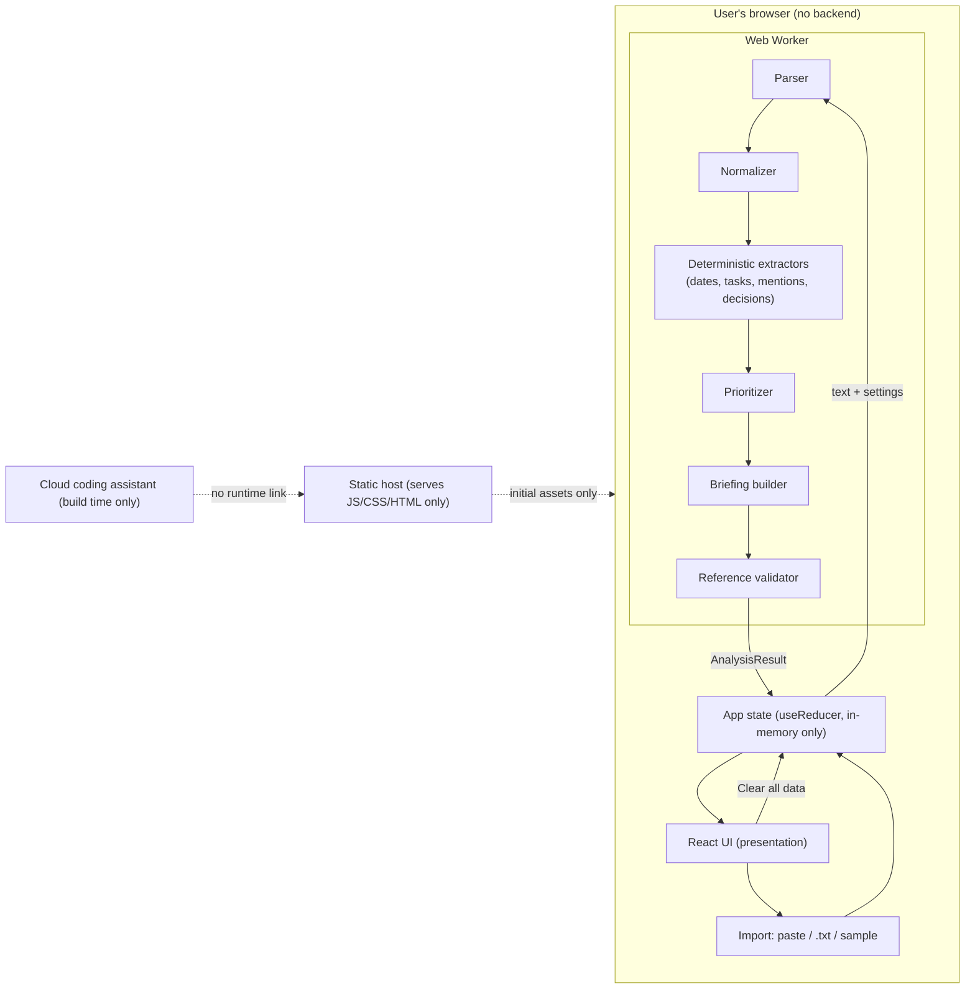
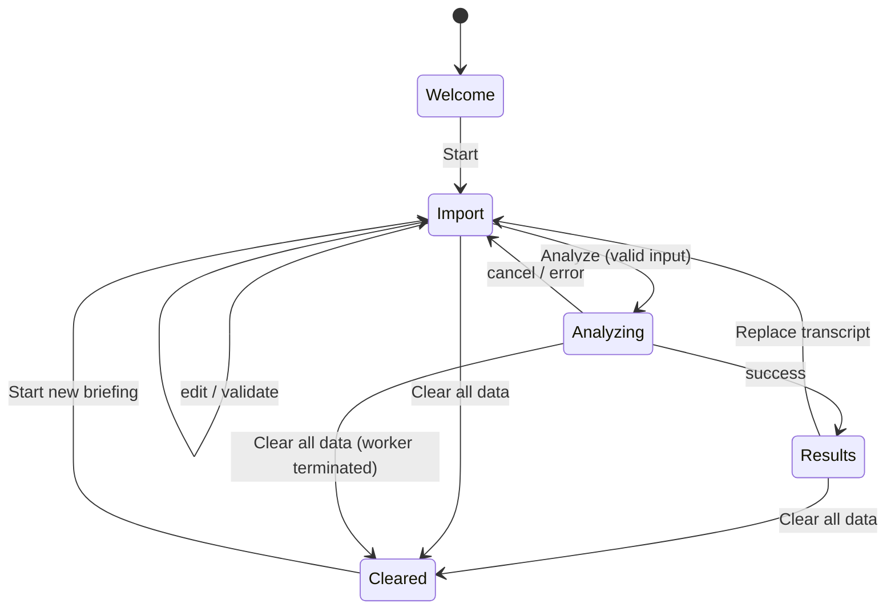

# Missiq — Product Requirements Document

> **Miss less. Know more.** — *Your private chat intelligence.*

## 1. Document Title, Version, Status, and Assumptions

| Field | Value |
|---|---|
| Product | Missiq |
| Document | Product Requirements Document (PRD) |
| Version | 1.0 |
| Date | 2026-10-09 |
| Status | Draft for implementation (hackathon MVP) |
| Hackathon | ProtocolX |
| Official problem statement | "The Unread Problem — What Did I Miss?" |
| Intended consumer | A developer or AI coding agent (Antigravity) implementing the MVP |
| Deliverable scope | Specification only. No application code is part of this document. |

### 1.1 Assumptions (explicit, unverified unless stated)

| ID | Assumption | How to verify |
|---|---|---|
| A-01 | The hackathon is short (assume 24–48 hours of build time). Exact duration is not specified here. | Confirm with organizers. |
| A-02 | Official scoring weights are not provided; none are invented in this document. | Check official materials. |
| A-03 | Users supply chat text by copy/paste or `.txt` export. No platform integration is needed. | Product decision (this PRD). |
| A-04 | Target browsers are current evergreen Chrome, Edge, Firefox, and Safari (last two major versions). | Manual smoke test. |
| A-05 | Hosting is a static host (e.g., GitHub Pages, Netlify, Vercel static). No server code runs. | Deployment check. |
| A-06 | Antigravity is a cloud-assisted development tool used only at build time. The shipped runtime has no cloud AI dependency. | Code inspection + network inspection. |
| A-07 | Transcripts in the MVP are English-language. Other languages degrade gracefully but are not guaranteed. | Test with a non-English sample. |
| A-08 | Relative dates ("tomorrow", "Friday") are resolved against a *reference date* the user can set, defaulting to the transcript's last message timestamp when available, otherwise "unresolved". | Unit tests. |
| A-09 | No user research findings, benchmark numbers, or legal certifications exist; none are claimed. | Review of this document. |

---

## 2. Executive Summary

Missiq is a browser-based, local-first micro-app that turns a long, unread chat transcript into an **evidence-backed briefing**. A user pastes chat text (or uploads a `.txt` export), optionally tells Missiq who they are, and receives:

- A concise briefing of what happened.
- A prioritized feed of important items.
- Extracted action items (with owner, deadline, and uncertainty when supported by evidence).
- Mentions of the user.
- Decisions, separated from suggestions, proposals, and open questions.
- A one-click path from every insight back to the exact source message.

All analysis runs in the browser using a **deterministic, rule-based engine**, labelled honestly as such. No transcript, derived insight, or summary is sent to any server or cloud AI. Data lives in memory only and can be cleared with one action. A genuine on-device model is an optional P2 stretch and must never compromise privacy or be mislabelled.

**Why this wins a hackathon:** it directly answers the problem statement, is verifiable (network tab shows zero requests carrying content), is explainable (every insight cites its source and its reason), and is honest about what it is (rules, not magic).

---

## 3. Problem Statement

**Official:** "The Unread Problem — What Did I Miss?" Build a simple AI micro-app that helps users quickly understand and prioritize important information from overwhelming chat conversations. Possible focus areas: summarizing long/unread conversations; identifying important messages, decisions, and action items; prioritizing by urgency and relevance; highlighting mentions, deadlines, and tasks; local-first processing so conversations, data, and summaries never leave the device.

**Treated as the primary source of truth.** Missiq addresses every listed focus area. It does not redefine the problem into a general chat client, task manager, or messaging integration.

---

## 4. Problem Analysis and Opportunity

### 4.1 Problem analysis

| Dimension | Observation (reasoned, not researched) |
|---|---|
| Volume | Active group chats accumulate hundreds of messages while a person is in class, in meetings, or offline. |
| Signal/noise | Critical items (deadlines, assignments, decisions) are interleaved with banter, reactions, and logistics. |
| Cost of missing | Missed deadlines, duplicated work, acting on superseded decisions. |
| Current workarounds | Scrolling, searching keywords, asking a teammate "what did I miss?", relying on pinned messages. |
| Privacy tension | Cloud summarizers require pasting private conversations into third-party services, which many users and organizations avoid. |

*These are product hypotheses, not user research findings. No survey data is claimed.*

### 4.2 Opportunity

A tool that is (a) **fast to use** (paste → briefing in seconds), (b) **verifiable** (every claim links to a source), and (c) **private by architecture** (nothing leaves the device) occupies a gap between "scroll manually" and "paste into a cloud chatbot".

### 4.3 Differentiators

1. **Evidence-first:** no insight without a source reference.
2. **Honest processing labels:** "Rule-based local analysis" vs "On-device model" are visibly distinct.
3. **Explainable priority:** each priority carries a human-readable reason.
4. **Uncertainty is shown, not hidden:** inferred vs explicit is distinguished.
5. **Verifiable privacy:** documented procedure to prove no content leaves the browser.

---

## 5. Product Vision and Objectives

**Vision:** Anyone returning to a long conversation can recover what matters in under a minute, and trust where it came from.

### 5.1 Objectives

| ID | Objective | Measure (testable) |
|---|---|---|
| OBJ-1 | Deliver a complete import → analysis → briefing vertical slice. | Acceptance checklist (§23) passes. |
| OBJ-2 | Every insight is traceable. | 100% of rendered insights have a valid `sourceMessageIds` entry (automated test). |
| OBJ-3 | Privacy claims are verifiable. | Network-inspection test shows no outbound request containing transcript content; storage test shows no private data in web storage. |
| OBJ-4 | Honest AI representation. | UI label and README never describe rule-based output as generative AI (review checklist). |
| OBJ-5 | Robust to bad input. | Edge-case test suite passes with no unhandled exceptions. |
| OBJ-6 | Deployed and demonstrable. | Public URL loads and runs the sample workflow. |

### 5.2 Non-objectives

Not a chat client, not a team task manager, not a messaging-platform integration, not a cloud service, not a general-purpose LLM chat.

---

## 6. Target Users and Personas

**Primary MVP persona: P1 — The Busy Student/Hackathon Team Member.** Chosen because their chats are informal, deadline-heavy, and decision-rich, which exercises every Missiq feature, and because the hackathon audience will relate immediately.

| Persona | Problem | Goals | Current workaround | Key information needs | Expected outcome |
|---|---|---|---|---|---|
| **P1 — Student / hackathon teammate (PRIMARY)** *e.g., Aarav, in classes all day while the project group chat hits 300 messages* | Misses deadlines, task assignments, and last-minute decisions. | Know what's due, what's been decided, what he owes. | Scrolls from last-read point; asks a friend. | Deadlines, tasks assigned to him, decisions, mentions. | A 60-second briefing with sources. |
| **P2 — Professional on a busy team** | Returns from leave/meetings to hundreds of messages. | Catch announcements and decisions affecting them. | Searches by keyword; skims. | Announcements, decisions, requests addressed to them. | Prioritized list of items needing a response. |
| **P3 — Returning group-chat participant** (family, community, club) | Long gaps; unclear what changed. | Understand logistics (time, place, who's bringing what). | Reads everything or asks. | Changes, plans, questions to them. | Short digest of changes and open questions. |
| **P4 — Hackathon team lead** | Needs to know who committed to what. | Audit commitments and unresolved items. | Manual notes. | Commitments by person, unresolved questions. | Commitments grouped by owner with sources. |

Examples are illustrative; Missiq does not assume any particular profession, organization, or messaging platform.

---

## 7. Jobs to Be Done and User Stories

### 7.1 Jobs to be done

- **JTBD-1:** When I come back to a long chat, help me understand what happened so I can rejoin without reading everything.
- **JTBD-2:** When deadlines or tasks may involve me, show me exactly what's mine and when it's due.
- **JTBD-3:** When decisions were made, tell me what was actually decided versus merely suggested.
- **JTBD-4:** When I doubt a summary, let me check the original message in one click.
- **JTBD-5:** When the chat is private, let me analyze it without it leaving my device.

### 7.2 User stories

| ID | Story | Maps to |
|---|---|---|
| US-01 | As a user, I can paste a transcript so I can analyze it quickly. | FR-002 |
| US-02 | As a user, I can upload a `.txt` file so I don't need to copy/paste. | FR-003 |
| US-03 | As a user, I can load a clearly labelled sample so I can try Missiq safely. | FR-005 |
| US-04 | As a user, I can enter my name so mentions and tasks are personalized. | FR-014 |
| US-05 | As a user, I see a concise briefing with sources. | FR-010 |
| US-06 | As a user, I see a priority feed with the reason for each priority. | FR-011 |
| US-07 | As a user, I see action items with owner/deadline/uncertainty. | FR-012 |
| US-08 | As a user, I can distinguish confirmed decisions from suggestions. | FR-015 |
| US-09 | As a user, I can open the original message for any insight. | FR-016 |
| US-10 | As a user, I can mark tasks complete and undo. | FR-013 |
| US-11 | As a user, I can clear everything with one action. | FR-019 |
| US-12 | As a user, I always see how my data is being processed. | FR-018 |

---

## 8. Product Principles

1. **Evidence over eloquence.** No source, no insight.
2. **Honesty about method.** Rules are labelled as rules. Models are labelled as models.
3. **Privacy by architecture, not policy.** There is no backend to send data to.
4. **Show uncertainty.** "Possibly a task" beats a confident wrong answer.
5. **Never invent.** No fabricated owners, deadlines, or decisions.
6. **Calm and precise.** Minimal chrome; accents reserved for meaning.
7. **Vertical slice first.** A working end-to-end flow beats many half-built features.
8. **Untrusted input.** Transcript text is data, never markup or code.

---

## 9. Scope and Out-of-Scope Features

### 9.1 In scope (MVP)

| Area | Included |
|---|---|
| Input | Paste text; `.txt` upload; sample transcript |
| Formats | Defined supported formats (FR-004); graceful degradation for others |
| Analysis | Deterministic local pipeline: parse, normalize, classify, extract, prioritize, brief |
| Outputs | Briefing, priority feed, action items, mentions, decisions, source viewer |
| Interactions | Filters, task complete/undo, clear data |
| Privacy | In-memory state only, honest status label, verification procedures |
| Delivery | Static deployment, tests, README.md, prompt.md |

### 9.2 Out of scope

| Excluded | Reason |
|---|---|
| Backend, auth, accounts, cloud DB, payments | Violates local-first goal; unnecessary |
| Direct WhatsApp/Slack/Discord/Telegram integration | Unofficial APIs/scraping prohibited; not required |
| Cloud AI inference on chats | Violates privacy requirement |
| Persistent storage of transcripts/results | Privacy; in-memory only |
| Analytics/telemetry | Could expose content |
| Real-time sync, notifications, mobile native app | Out of micro-app scope |
| Editing or sending messages | Missiq is read-only analysis |
| Image/voice/attachments analysis | Not feasible in time budget |
| Full task-management (projects, assignees, reminders) | Beyond purpose |
| Claims of generative summarization from rules | Dishonest |

### 9.3 Optional (P2, only if the core is done)

On-device language model; extra transcript formats; semantic ranking; advanced filters.

---

## 10. Functional Requirements

Priority key: **P0** essential, **P1** important, **P2** optional. All requirements are verifiable; test IDs refer to §22.

### 10.1 Requirement index

| ID | Name | Priority |
|---|---|---|
| FR-001 | Landing and onboarding | P0 |
| FR-002 | Paste import | P0 |
| FR-003 | `.txt` file upload | P0 |
| FR-004 | Supported formats and unsupported-format handling | P0 |
| FR-005 | Sample transcript | P0 |
| FR-006 | Replace / clear transcript | P0 |
| FR-007 | Message parsing | P0 |
| FR-008 | Normalization and duplicate handling | P0 |
| FR-009 | Deadline and date detection | P0 |
| FR-010 | Conversation briefing (summary) | P0 |
| FR-011 | Priority feed | P0 |
| FR-012 | Action-item extraction | P0 |
| FR-013 | Task completion and undo | P0 |
| FR-014 | User identity and mention detection | P1 |
| FR-015 | Decision extraction | P1 |
| FR-016 | Source-message traceability | P0 |
| FR-017 | Filters and views | P1 |
| FR-018 | Processing-status indicator | P0 |
| FR-019 | Clear-data control | P0 |
| FR-020 | Error handling and interrupted analysis | P0 |
| FR-021 | On-device model (optional) | P2 |

### 10.2 Detailed requirements

#### FR-001 Landing and onboarding (P0)
- **Description:** A single welcome screen introducing Missiq, the tagline, the local-first explanation, supported formats, and one call to action ("Start a briefing").
- **User value:** Understand purpose and trust model in under 15 seconds of reading.
- **Preconditions:** App loaded.
- **Expected behavior:** Shows product name, tagline, descriptor; a truthful privacy statement (see §18.6 wording); supported-format summary; CTA navigates to import. No multi-step onboarding.
- **Acceptance criteria:** (1) CTA reachable by keyboard and activates import view. (2) Privacy text states: analysis runs in your browser; the app does not upload your chat; initial app files are downloaded from the host. (3) No claim of "AI-generated" or "fully offline".
- **Error states:** None (static).
- **Tests:** T-UI-001, T-PRV-007.

#### FR-002 Paste import (P0)
- **Description:** A labelled multi-line text area accepts pasted transcript text.
- **User value:** Fastest path from any chat app (copy → paste).
- **Preconditions:** Import view displayed.
- **Expected behavior:** Character/line counter shown; "Analyze" disabled until valid non-empty input; limits enforced (§20: 1,000,000 characters and 20,000 lines hard cap; warn above 200,000 characters).
- **Acceptance criteria:** Empty/whitespace-only input rejected with message "Paste a conversation to analyze."; over-limit input rejected with message naming the limit; input never stored in storage, URL, or logs.
- **Error states:** E-IMP-EMPTY, E-IMP-TOOLARGE.
- **Tests:** T-IMP-001..004.

#### FR-003 `.txt` file upload (P0)
- **Description:** User selects a `.txt` file via a keyboard-accessible file control (and optional drag-and-drop).
- **Preconditions:** Import view displayed.
- **Expected behavior:** Validate extension `.txt` and MIME `text/plain` (or empty MIME); size ≤ 5 MB; read locally with `FileReader`/`File.text()`; decode UTF-8 (strip BOM); on decode problems show a warning and continue with replacement characters only if >0 usable lines. File content populates the import text area for review before analysis.
- **Acceptance criteria:** Files with other extensions rejected; binary content (null bytes) rejected; oversized files rejected before reading fully; no network request occurs.
- **Error states:** E-IMP-TYPE, E-IMP-BINARY, E-IMP-TOOLARGE, E-IMP-READ.
- **Tests:** T-IMP-005..010.

#### FR-004 Supported formats and unsupported-format handling (P0)
- **Description:** Define and communicate what is parsed reliably.
- **Supported formats (MVP):**

| ID | Format | Example |
|---|---|---|
| F1 | Bracketed timestamp + sender | `[12/03/2026, 14:05] Priya: Submit the deck by Friday` |
| F2 | Dash-style timestamp + sender (common mobile export style) | `12/03/2026, 14:05 - Priya: Submit the deck by Friday` |
| F3 | ISO timestamp + sender | `2026-03-12 14:05 Priya: text` or `2026-03-12T14:05:00 Priya: text` |
| F4 | Sender only, no timestamp | `Priya: Submit the deck by Friday` |

  Continuation lines (lines not matching a message header) are appended to the previous message as multiline text.
- **Unsupported handling:** If fewer than 50% of non-empty lines are parseable *and* fewer than 3 messages parse, show: "Missiq could not recognize this as a supported chat format. Supported formats: …" with examples, and offer "Analyze as plain text anyway", which treats each non-empty line as a message with sender "Unknown" and `parsingStatus: "unattributed"`, with a visible banner that results are limited.
- **Acceptance criteria:** Parsing report shows N messages recognized, M lines unrecognized; copy never says "all chat exports supported".
- **Tests:** T-PAR-001..012.

#### FR-005 Sample transcript (P0)
- **Description:** A button loads a built-in synthetic sample transcript (see Appendix A).
- **Expected behavior:** Loads sample into the text area; a persistent "Sample data" badge shown on all result views while the sample is the source; sample contains no real people.
- **Acceptance criteria:** Results from the sample are produced by the real pipeline (not hard-coded); badge disappears when the user replaces or clears the text.
- **Tests:** T-IMP-011, T-UI-004.

#### FR-006 Replace / clear transcript (P0)
- **Description:** User can replace the text area content or clear it.
- **Expected behavior:** "Clear text" empties the input; analyzing new text replaces prior results entirely (no merge).
- **Acceptance criteria:** After replacement no insight from the old transcript remains in state.
- **Tests:** T-STATE-001.

#### FR-007 Message parsing (P0)
- **Description:** Convert raw text into ordered `ParsedMessage[]` per §16.
- **Expected behavior:** Header detection by ordered regex set (F1–F4); sender extracted up to the first `: ` after the timestamp; timestamps parsed per §17.3; multiline continuation; system lines (e.g., "Messages are end-to-end encrypted") flagged `kind: "system"` and excluded from insights; `sourceIndex` = zero-based order in the original input and `lineStart/lineEnd` = 1-based line numbers.
- **Acceptance criteria:** Message ids are deterministic (`m-<sourceIndex>`); indices never change after sorting/filtering; malformed lines never throw.
- **Error states:** E-PAR-NOMSG (zero messages).
- **Tests:** T-PAR-*.

#### FR-008 Normalization and duplicate handling (P0)
- **Description:** Normalize whitespace, unicode (NFC), smart quotes, zero-width characters, and case for matching **without altering stored original text**.
- **Expected behavior:** Exact duplicate consecutive messages (same sender, timestamp, normalized text) are collapsed for *analysis* only: the duplicate stays in the message list flagged `isDuplicateOf`, and does not create a second insight.
- **Acceptance criteria:** Original text remains verbatim in source viewer; duplicates produce one insight.
- **Tests:** T-PAR-010, T-ANA-020.

#### FR-009 Deadline and date detection (P0)
- **Description:** Detect explicit deadline expressions.
- **Supported expressions:** absolute dates (`12 Mar`, `March 12`, `12/03/2026`, ISO), weekdays (`by Friday`), relative days (`today`, `tomorrow`, `tonight`), times (`5pm`, `17:00`), phrases `EOD`, `by <date>`, `before <date>`, `due <date>`, `deadline <date>`.
- **Resolution rules:** Relative expressions resolve only against the **reference date** = (a) the message's own timestamp if present, else (b) a user-supplied reference date, else the date stays **unresolved** and is shown as the literal phrase (e.g., "by Friday — date unresolved").
- **Ambiguity:** `dd/mm` vs `mm/dd` ambiguous values (both ≤12) are flagged `ambiguous: true`, shown as written, and never converted silently. A format-locale setting (DD/MM or MM/DD) is inferred only if unambiguous evidence exists elsewhere in the transcript (any value >12 in the first field or second field); otherwise remains ambiguous.
- **Acceptance criteria:** No deadline is ever created without matching text in a source message; `deadline.rawText` must be a substring of the source message normalized text.
- **Tests:** T-DDL-001..010.

#### FR-010 Conversation briefing (P0)
- **Description:** A clearly labelled **rule-based briefing** assembled from extracted insights; not generative text.
- **Structure (fixed order):** 1) Header: "Rule-based briefing" label + coverage statement ("Analyzed N of M lines; K lines unrecognized"). 2) "Needs your attention" (top ≤5 by priority, personalized when a user is set). 3) Deadlines (sorted by resolved date; unresolved last). 4) Decisions (confirmed only; others in Decisions view). 5) Announcements. 6) Open questions (unanswered questions, see §17.6). 7) Main topics (top ≤5 keyword phrases with message counts). 8) Activity overview (message count, participants, time span if timestamps exist).
- **Length:** Each section ≤5 items collapsed with "Show all"; each item one line ≤160 chars (truncate with ellipsis; full text in source viewer).
- **Traceability:** Every line carries a source chip linking to the source message(s).
- **Empty state:** Sections with no items are hidden, except a single line "No tasks, deadlines or decisions were detected" if all are empty, accompanied by coverage statement.
- **Limitations text:** Always visible expandable "How this briefing was made" describing rules and limits.
- **Acceptance criteria:** Every line has ≥1 valid source reference; briefing contains no text not derivable from source messages other than fixed labels/counts.
- **Tests:** T-SUM-001..008.

#### FR-011 Priority feed (P0)
- **Description:** Ordered list of insights with priority category and reason.
- **Categories:**

| Category | Meaning | Required evidence |
|---|---|---|
| **Critical** | Time-bound item affecting the user, or an explicit high-priority marker by a participant, with imminent resolved deadline (≤48h after reference date) or unresolved deadline plus direct assignment to the user | Explicit deadline/marker **and** relevance to user (mention/assignment) |
| **High** | Direct task assignment to the user, direct mention with a request, or confirmed decision/announcement flagged as important with explicit marker | Assignment pattern or mention+request |
| **Medium** | Tasks for others with deadlines, confirmed decisions, announcements, open questions to the user | Pattern match with source |
| **Low** | General commitments, suggestions, proposals, unassigned requests without deadline | Pattern match with source |
| **Info** | Everything else (general discussion) — shown only in "All" view | None |

- **Explicit vs inferred:** Each insight has `priorityBasis: "explicit" | "inferred"`. *Explicit* = the text contains a marker (e.g., "urgent", "ASAP", "important", "deadline", "must", "!!") from a participant. *Inferred* = derived from patterns (assignment, mention) without explicit marker.
- **Urgency words do not auto-elevate:** An urgency marker alone yields at most Medium unless combined with deadline or user relevance (rule R-PRI-03, §17.5).
- **Reason:** Each item displays a one-line reason, e.g., "Assigned to you · due Fri (explicit date)".
- **Ordering:** by category rank, then resolved deadline ascending (unresolved last), then source index ascending; the sort is stable and deterministic.
- **Acceptance criteria:** No High/Critical without evidence listed in `reasons`; ordering test passes; source references unchanged after sorting.
- **Tests:** T-PRI-001..012.

#### FR-012 Action-item extraction (P0)
- **Description:** Extract tasks as `ActionItem` per §16.
- **Types (`kind`):** `assigned-to-user`, `assigned-to-other`, `commitment` ("I'll…", "I will…"), `unassigned-request` ("we need to…", "someone should…", "can someone…"), `inferred` (weak pattern; flagged uncertain).
- **Fields:** description (excerpt from source, ≤200 chars), assignee (name as written or null), deadline (from FR-009 or null), priority category, reasons, source reference, completion state, `confidence: "high" | "medium" | "low"`, `uncertaintyNotes[]`.
- **Negation/cancellation:** Patterns such as "no need to", "don't need to", "cancelled", "never mind", "scratch that", "already done" mark the related task `status: "possibly-cancelled"` or suppress extraction when in the same message; later messages that reference the same task text can lower confidence (heuristic: shared content token(s) + cancellation marker within 10 messages) and add an uncertainty note.
- **No invention:** Assignee must appear in the source message or be the sender (for first-person commitments). Deadline must come from the same message or an explicit adjacent reply from the same sender (≤3 messages) — in the latter case flagged `deadlineSource: "nearby"`.
- **Acceptance criteria:** All items have a valid source id; "Priya, please send the report by Friday" yields assignee "Priya", deadline "Friday" (unresolved if no reference date); "someone should look into hosting" yields `unassigned-request`, no assignee, no deadline.
- **Tests:** T-ACT-001..015.

#### FR-013 Task completion and undo (P0)
- **Description:** Per-item checkbox toggles `completed`.
- **Expected behavior:** Completion is stored only in app state as a separate map `completedIds`, never altering messages or insights; a toast offers "Undo" for ≥8 seconds; keyboard shortcut not required; completed items move to a "Completed" tab/filter and remain visible.
- **Acceptance criteria:** Toggle twice returns original state; clearing data resets completion; original transcript untouched.
- **Tests:** T-ACT-020..023.

#### FR-014 User identity and mention detection (P1)
- **Description:** Optional "I am…" input accepting a name and optional aliases (comma-separated, max 5, each ≤40 chars).
- **Matching rules:** Case-insensitive, whole-token matching using Unicode word boundaries; `@name` also matches; sender names are matched separately (a message *from* the user is "authored by you", not a mention). Possessive `Priya's` matches `Priya`. No fuzzy matching in MVP.
- **False-match avoidance:** `Ann` must not match `Annual`, `Channel`; `Sam` must not match `Samsung`, `Samuel` unless `Samuel` is configured; similar names (`Priya` vs `Priyanka`) are distinct.
- **Ambiguity:** If two participants share a first token with the configured name (e.g., user "Sam", participants "Sam K" and "Sam R"), show a banner "Multiple participants match your name" and mark matches `ambiguous: true`.
- **Limitations disclosure:** Visible note: "Mention detection matches names as written; nicknames, pronouns, and misspellings are not detected."
- **Acceptance criteria:** Test matrix of 12 positive/negative cases passes.
- **Tests:** T-MEN-001..012.

#### FR-015 Decision extraction (P1)
- **Description:** Classify decision-related messages into `DecisionStatus`: `confirmed`, `proposal`, `suggestion`, `question`, `disagreement`.
- **Rules (summary; full in §17.4):**
  - `confirmed`: explicit commit phrases ("we decided", "let's go with", "final:", "it's settled", "approved", "agreed") **or** a proposal followed by ≥1 affirmative reply ("sounds good", "agreed", "+1", "yes") from a different participant and no objection after it.
  - `proposal`: "what if we", "I propose", "how about", "shall we" without confirmation.
  - `suggestion`: "should", "could", "maybe", "might want to", "I think we" — never confirmed by these words alone.
  - `question`: ends with `?` and decision vocabulary.
  - `disagreement`: proposal followed by objection ("no", "I disagree", "not sure about") with no later resolution.
- **Contradiction handling:** Later confirmed decisions on the same topic key (shared noun phrase) mark the earlier one `superseded: true` with a note and link to the newer message; when topic matching is uncertain, both are shown with an uncertainty note instead of choosing one.
- **Acceptance criteria:** "maybe we should use Postgres" never yields `confirmed`; "Proposal: Postgres" + "agreed" yields `confirmed` with both messages as sources.
- **Tests:** T-DEC-001..010.

#### FR-016 Source-message traceability (P0)
- **Description:** Each insight exposes the message(s) that support it.
- **Expected behavior:** A "Source" control (button) on every insight opens a source panel/drawer displaying sender, timestamp (or "No timestamp"), original verbatim text (plain text, no HTML), message number ("Message 47 of 312"), and line range; surrounding context toggle shows 2 messages before and after; matched evidence span is highlighted using text ranges (not HTML injection). Escape closes; focus returns to the trigger.
- **Acceptance criteria:** Every rendered insight has ≥1 resolvable `sourceMessageIds`; invalid references fail validation in tests and never render; references stay correct after any sort/filter.
- **Tests:** T-SRC-001..006.

#### FR-017 Filters and views (P1)
- **Description:** Filter by priority, category (task, decision, mention, deadline, announcement, question), completed/incomplete, "mine only" (requires user identity).
- **Acceptance criteria:** Filters combine with AND; counts update; "Reset filters" visible; empty-filter result shows "No items match these filters."
- **Tests:** T-FIL-001..005.

#### FR-018 Processing-status indicator (P0)
- **Description:** Persistent status chip.
- **States (exact labels):**

| State | Label | Meaning |
|---|---|---|
| Idle | "Ready — nothing loaded" | No data |
| Analyzing | "Analyzing locally (rule-based)…" | Pipeline running |
| Complete | "Analyzed locally · Rule-based, no AI model" | Deterministic analysis done |
| Model (P2 only) | "On-device model: <name> (runs in your browser)" | Only when a model actually ran |
| Cleared | "Data cleared" | After clear |
| Error | "Analysis failed — no data was sent anywhere" | Only if true |

- **Acceptance criteria:** The "On-device model" label is impossible to display unless the model-inference code path executed (enforced by a unit test with state-machine guard); chip is exposed to screen readers via `role="status"`.
- **Tests:** T-PRV-001, T-PRV-002.

#### FR-019 Clear-data control (P0)
- **Description:** Prominent "Clear all data" button in the header while any data exists.
- **Expected behavior:** Resets transcript text, parsed messages, analysis, completion map, filters, selected source, user identity, and reference date; terminates any running analysis (Web Worker `terminate()`/abort) before reset; shows cleared-state screen; moves focus to the page heading. Also releases `File` references and revokes any object URLs.
- **Acceptance criteria:** After clear, a heap/state inspection (React DevTools or test assertion) shows empty state; no stale results flash; analysis in progress cannot repopulate state after clear (cancellation token check).
- **Tests:** T-PRV-004, T-STATE-002..003.

#### FR-020 Error handling and interrupted analysis (P0)
- **Description:** All failures produce a user-readable message without echoing transcript content.
- **Expected behavior:** Error boundary at app root with generic fallback; worker errors captured and mapped to codes; analysis timeout (soft: 10 s "taking longer than expected, keep waiting / cancel"); cancel button during analysis; partial results never shown as complete.
- **Acceptance criteria:** Forced exceptions in each pipeline stage (test injection) show the correct message with no transcript text in message, console, or error object serialization.
- **Tests:** T-ERR-001..006.

#### FR-021 On-device model (P2, optional)
- See §17.8. Must pass the privacy gate (G-MODEL) before merge; otherwise omitted.

---

## 11. User Journeys

### J1 — First-time user, sample (primary demo path)
1. Landing → "Start a briefing".
2. Import view → "Load sample".
3. Enter name "Aarav" in "I am…".
4. "Analyze" → progress indicator → results.
5. Reads "Needs your attention", opens a source for the top task, marks it complete, undoes it.
6. Clicks "Clear all data" → cleared state.

### J2 — Real transcript via paste
Copy chat → paste → parsing report shows "142 messages recognized, 6 lines unrecognized" → analyze → filter to "Mine only" + "Critical/High" → inspect sources.

### J3 — Upload `.txt`
Select file → validation passes → text appears in editor → analyze.

### J4 — Unsupported format
Paste free-form text → "not recognized" message with examples → choose "Analyze as plain text anyway" → limited results banner.

### J5 — Invalid file
Select `.pdf` → "Only .txt files are supported" → no state change.

### J6 — Interrupted analysis
Start analysis on large input → press Cancel → worker terminated → return to import with text preserved (in memory) and message "Analysis cancelled."

---

## 12. Screen-by-Screen UX Specifications

Global: single-page app; header with logo, name, status chip (FR-018), "Clear all data" (when data exists). Skip link "Skip to main content". All interactive elements ≥44×44 px target on touch. Visible focus ring (2 px Signal Mint outline with 2 px offset; contrast ≥3:1 against adjacent colors). Respect `prefers-reduced-motion`. No auto-playing animation.

| # | Screen | Layout & content | Behavior | Responsive | A11y |
|---|---|---|---|---|---|
| 1 | **Welcome** | Logo, "Missiq", tagline, descriptor, 3 short value statements, privacy statement, formats summary, CTA | CTA → Import | Single column <768 px; centered max-width 720 px desktop | `h1`, landmark `main`, CTA is `button` |
| 2 | **Import** | Left: textarea (label "Paste your conversation"), counters; actions: Upload `.txt`, Load sample, Clear text; Right/below: "I am…" name + aliases, optional reference date, supported formats accordion; primary "Analyze" | Validation inline; parse preview line "N messages recognized" updates on debounce (≤300 ms) | Two-column ≥1024 px; stacked below | Labels via `<label>`; errors in `aria-live="polite"` region; `aria-describedby` for hints |
| 3 | **Analysis in progress** | Status chip animates (non-flashing), determinate progress by stage (Parsing → Detecting → Prioritizing → Building briefing), Cancel button | Stages reported by worker; UI remains responsive | Same | `role="progressbar"` with `aria-valuenow`; stage text in live region |
| 4 | **Summary dashboard** | Coverage banner, "Sample data" badge if applicable, briefing sections per FR-010, tabs: Briefing · Priority · Tasks · Decisions · Mentions | Tab state in memory (not URL hash containing content; routes without content only) | Tabs → scrollable segmented control on mobile | `tablist` pattern with arrow-key navigation |
| 5 | **Priority feed** | Filter bar; list of cards: category badge, one-line text, reason line, source button, timestamp/sender | Sort fixed (§FR-011) | Cards full-width mobile | Badge conveys text, not only color |
| 6 | **Action items** | Grouped: Assigned to you · Others · Commitments · Unassigned requests · Uncertain; checkbox, description, assignee, deadline (with "unresolved/ambiguous" tags), confidence tag | Complete/undo toast | Same | Checkbox with accessible name including description |
| 7 | **Decisions & Mentions** | Decisions grouped by status with explanatory header; mentions list showing context snippet and match highlight | Superseded decisions de-emphasized with note | Same | Highlight uses `<mark>` plus text label |
| 8 | **Source detail** | Side drawer (≥1024 px) / bottom sheet (mobile): sender, timestamp, "Message X of Y", lines, verbatim text, evidence highlight, context toggle | Focus trap; Esc closes; returns focus | Full-screen sheet on mobile | `role="dialog"` `aria-modal`, labelled heading |
| 9 | **Empty state** | Shown for: no insights found; filter yields none. Message plus coverage statement and tip. Never shows fabricated examples | — | — | — |
| 10 | **Validation/processing errors** | Inline error summary with codes (user-readable, no content), action buttons (Fix input / Try again) | Focus moves to error summary | — | `role="alert"` |
| 11 | **Cleared state** | "Your data was cleared. Nothing was stored." + "Start new briefing" | Focus to heading | — | — |

---

## 13. Brand and Design System

### 13.1 Identity
Name **Missiq** (capital M, lowercase rest, always). Tagline "Miss less. Know more." Descriptor "Your private chat intelligence." Personality: futuristic, premium, intelligent, calm, precise, trustworthy.

### 13.2 Color tokens

| Token | Hex | Use |
|---|---|---|
| `--midnight` | `#080D14` | App background |
| `--graphite` | `#18232F` | Surfaces, cards |
| `--mint` (Signal Mint) | `#35E0B1` | Primary actions, focus ring, positive status |
| `--ice` (Ice White) | `#F2F7F9` | Primary text on dark |

Derived tokens (must be tested for contrast, not assumed):

| Token | Suggested | Use |
|---|---|---|
| `--graphite-2` | `#223142` | Raised surface, borders |
| `--ice-muted` | `#A9B8C2` | Secondary text (verify ≥4.5:1 on Graphite) |
| `--warn` | `#F5B544` | High-priority badges |
| `--danger` | `#FF6B6B` | Critical badges, errors |
| `--info` | `#6CB6FF` | Info badges |

Contrast requirement: body text ≥ 4.5:1; large text and UI boundaries ≥ 3:1. Verify with an automated check (e.g., axe) and a manual contrast calculator; do not assume the derived values pass.

Light theme: not required for MVP (P2). Dark theme only; `color-scheme: dark`.

### 13.3 Typography
System font stack by default (`ui-sans-serif, system-ui, -apple-system, "Segoe UI", Roboto, sans-serif`) to **avoid external font requests**. If a webfont is used, self-host it from the same origin (no Google Fonts CDN) and document it. Monospace for message-reference chips.
Scale: 14/16/18/24/32 px; line height 1.5 body.

### 13.4 Spacing, shape, motion
8 px spacing grid; card radius 12 px; borders 1 px `--graphite-2`; shadows minimal; no large glows. Motion ≤200 ms, opacity/translate only, disabled under `prefers-reduced-motion`.

### 13.5 Logo
Original inline SVG: three concentric circles (stroke `--mint`, decreasing opacity outward) with a small waveform/radar sweep path through the center; works at 24 px and 128 px; `<title>Missiq</title>` for accessibility; no external assets.

### 13.6 Priority badge styling

| Category | Color | Text label |
|---|---|---|
| Critical | `--danger` | "Critical" |
| High | `--warn` | "High" |
| Medium | `--info` | "Medium" |
| Low | `--ice-muted` | "Low" |
| Info | neutral | "Info" |

Every badge includes text; color is never the sole signal.

---

## 14. Information Architecture

```
Missiq (single-page app, no persistent routes with data)
├── Welcome
├── Import
│   ├── Paste / Upload / Sample
│   ├── Identity (name, aliases, reference date)
│   └── Format help
├── Results (after analysis)
│   ├── Briefing
│   ├── Priority feed
│   ├── Tasks
│   ├── Decisions
│   ├── Mentions
│   └── Source drawer (overlay)
├── Cleared state
└── Persistent chrome: header (logo, status chip, Clear all data), privacy footer
```

Navigation model: view state held in memory (`view: "welcome" | "import" | "analyzing" | "results" | "cleared"`). URLs must **never** contain transcript content, names, or insights. Hash/path routing is optional and may encode only the view name.

---

## 15. Technical Architecture

### 15.1 Stack and justification

| Layer | Choice | Justification |
|---|---|---|
| UI | React 18+ with TypeScript (strict) | Specified preference; strong typing for data model |
| Build | Vite | Fast static build; no server |
| Styling | Tailwind CSS (design tokens in config) | Speed; tokens map to §13 |
| State | React `useReducer` + Context (no persistence middleware) | No dependency; guarantees no accidental persistence |
| Heavy compute | One dedicated Web Worker (module worker) | Keeps UI responsive; cancellable via `terminate()` |
| Tests | Vitest + React Testing Library + (P1) Playwright | Vite-native; E2E for privacy network checks |
| Lint/format | ESLint + TypeScript `tsc --noEmit` + Prettier | Quality gates |
| Accessibility checks | `eslint-plugin-jsx-a11y`, `axe-core` (dev dependency, test-time only) | Automated a11y |

**No** backend, auth, database, analytics, router library (not needed), state library, or UI kit. Runtime dependencies target: `react`, `react-dom` only (plus optional tiny utilities if justified in README). Every added dependency must be recorded with name, version, license, and reason.

If the Web Worker adds integration risk under time pressure, fallback: run the pipeline on the main thread with chunked `await` yields (documented trade-off; cancel via token).

### 15.2 Architecture diagram



### 15.3 Data-flow / state machine



State transitions are pure reducer actions: `SET_TEXT`, `SET_IDENTITY`, `START_ANALYSIS`, `ANALYSIS_PROGRESS`, `ANALYSIS_SUCCESS`, `ANALYSIS_ERROR`, `CANCEL`, `TOGGLE_TASK`, `UNDO_TOGGLE`, `SET_FILTERS`, `OPEN_SOURCE`, `CLOSE_SOURCE`, `CLEAR_ALL`. Each analysis run has a monotonic `runId`; results with a stale `runId` are discarded (prevents repopulation after clear/cancel).

### 15.4 Module responsibilities

| Module | Path | Responsibility | Depends on |
|---|---|---|---|
| Presentation | `src/components/**` | Rendering only; no parsing logic | state hooks, types |
| App state | `src/state/**` | Reducer, context, selectors | types |
| Import | `src/import/**` | Text/file validation, limits, sample loader | types, constants |
| Parser | `src/analysis/parse/**` | Header regexes, multiline merge, timestamp parse | types |
| Normalizer | `src/analysis/normalize.ts` | Unicode/whitespace normalization for matching | — |
| Extractors | `src/analysis/extract/**` | `dates.ts`, `tasks.ts`, `mentions.ts`, `decisions.ts`, `questions.ts`, `announcements.ts` | normalizer, types |
| Prioritizer | `src/analysis/prioritize.ts` | Rule table → category + reasons | extractors' outputs |
| Briefing | `src/analysis/briefing.ts` | Assemble sections from insights | prioritizer |
| Source refs | `src/analysis/sourceRefs.ts` | Build/validate references, evidence spans | types |
| Worker | `src/workers/analysis.worker.ts` | Orchestrates pipeline; posts progress | analysis modules |
| Privacy | `src/privacy/**` | Status model, clear routine, storage guard (dev-time assertion that wraps `Storage.prototype.setItem` in tests) | state |
| Test utilities | `src/testing/**` | Transcript builders, fixtures, assertion helpers | types |
| Constants | `src/config/limits.ts`, `src/config/patterns.ts` | Limits and rule vocabularies (data, not code) | — |

Rule vocabularies live in `patterns.ts` as typed data so they can be reviewed and unit tested independently.

### 15.5 Directory structure

```
missiq/
├── index.html
├── package.json
├── vite.config.ts
├── tsconfig.json
├── tailwind.config.ts
├── eslint.config.js
├── README.md
├── prompt.md
├── PRD.md
├── public/
│   └── favicon.svg
├── src/
│   ├── main.tsx
│   ├── App.tsx
│   ├── components/
│   │   ├── layout/ (Header, StatusChip, PrivacyFooter, ClearButton)
│   │   ├── welcome/
│   │   ├── import/ (TranscriptInput, FileDrop, IdentityForm, FormatHelp)
│   │   ├── results/ (BriefingView, PriorityFeed, TaskList, DecisionList, MentionList, FilterBar)
│   │   ├── source/ (SourceDrawer, EvidenceText)
│   │   └── common/ (Badge, Button, Toast, ErrorSummary)
│   ├── state/ (reducer.ts, context.tsx, selectors.ts, actions.ts)
│   ├── import/ (validate.ts, readFile.ts, sample.ts)
│   ├── analysis/
│   │   ├── parse/ (headers.ts, timestamps.ts, parseTranscript.ts)
│   │   ├── normalize.ts
│   │   ├── extract/ (dates.ts, tasks.ts, mentions.ts, decisions.ts, questions.ts, announcements.ts, topics.ts)
│   │   ├── prioritize.ts
│   │   ├── briefing.ts
│   │   └── sourceRefs.ts
│   ├── workers/ (analysis.worker.ts, workerClient.ts)
│   ├── privacy/ (status.ts, clearAll.ts)
│   ├── config/ (limits.ts, patterns.ts, tokens.ts)
│   ├── types/ (model.ts)
│   ├── testing/ (builders.ts, fixtures/*.txt)
│   └── styles/ (index.css)
├── tests/
│   ├── unit/ ...
│   ├── component/ ...
│   └── e2e/ (privacy-network.spec.ts, flow.spec.ts)
└── .github/workflows/ci.yml
```

### 15.6 Keeping private data out of persistent storage

1. State lives only in the React reducer (JS heap).
2. No code references `localStorage`, `sessionStorage`, `indexedDB`, `document.cookie`, `history.pushState` with content, `navigator.sendBeacon`, `fetch`, `XMLHttpRequest`, or `WebSocket` in `src/` except an allow-listed module (none required in MVP; the app makes no runtime `fetch`). An ESLint `no-restricted-globals`/`no-restricted-properties` rule enforces this and CI fails on violation.
3. No service worker in MVP (avoids caching content and ambiguity about offline). Offline use after first load relies on normal HTTP caching and is **not** guaranteed; see §20.
4. React DevTools/console logging: production build strips `console.*` via build config; code review forbids logging message content.
5. Controlled `<textarea>` content is in state only; browser form-restore ("autocomplete=off", `spellcheck=false`) is set on the textarea to reduce browser-side persistence of draft text. (Residual: browser session-restore may retain form fields; documented as residual risk.)
6. The user identity and reference date are treated as private and cleared with data.

### 15.7 Content Security Policy (required)

Delivered via `<meta http-equiv="Content-Security-Policy">` or host headers:

```
default-src 'self';
script-src 'self';
style-src 'self';
img-src 'self' data:;
font-src 'self';
connect-src 'none';
worker-src 'self' blob:;
object-src 'none';
base-uri 'none';
form-action 'none';
frame-ancestors 'none'
```

`connect-src 'none'` makes any runtime network request from the page fail in the browser, giving a strong, testable technical enforcement of the "no upload" claim (it does not stop the user's browser extensions or the host's access logs, which are out of the app's control). If Tailwind/Vite inline styles require `'unsafe-inline'` for styles, document the exception; never allow `'unsafe-inline'` or `'unsafe-eval'` for scripts. (`frame-ancestors` is ignored in `<meta>`; use a host header where possible, otherwise document.)

---

## 16. Data Model and TypeScript Interfaces

All types in `src/types/model.ts`. Identity and referencing rules:

- Messages are the **single store** of private text. Insights hold **ids and character offsets**, plus a short bounded excerpt (≤200 chars) only where the UI needs it. This avoids duplicating whole messages and keeps references stable.
- `MessageId = "m-" + sourceIndex` where `sourceIndex` is the zero-based position in original parse order. It is never recomputed after sorting or filtering. Views sort copies of arrays.
- Any insight must pass `validateReferences(result)` before being stored in state.

```ts
export type MessageId = string; // "m-<sourceIndex>"

export type ParsingStatus =
  | "parsed"          // header recognized (sender, optional timestamp)
  | "no-timestamp"    // sender recognized, no timestamp
  | "unattributed"    // plain-text fallback, sender unknown
  | "system"          // recognized system/notification line
  | "malformed";      // could not be interpreted; retained as continuation or orphan

export interface TextSpan {
  start: number; // inclusive char offset into ParsedMessage.text
  end: number;   // exclusive
}

export interface ParsedMessage {
  id: MessageId;
  sourceIndex: number;            // >= 0, unique, ascending in parse order
  lineStart: number;              // 1-based line in original input
  lineEnd: number;                // >= lineStart
  sender: string | null;          // null if unattributed/system
  timestamp?: ParsedTimestamp;    // absent when not parseable
  text: string;                   // verbatim, multiline joined by "\n"
  parsingStatus: ParsingStatus;
  isDuplicateOf?: MessageId;      // analysis skips duplicates
  mentions: Mention[];            // filled after identity set; may be empty
}

export interface ParsedTimestamp {
  raw: string;                    // as written
  iso?: string;                   // ISO-8601 local (no TZ assumed) if unambiguous
  ambiguous: boolean;             // true if dd/mm vs mm/dd cannot be resolved
}

export interface Conversation {
  messages: ParsedMessage[];      // ordered by sourceIndex
  participants: string[];         // unique sender names (as written)
  stats: {
    totalLines: number;
    nonEmptyLines: number;
    messageCount: number;
    unrecognizedLines: number;
    formatDetected: "F1" | "F2" | "F3" | "F4" | "mixed" | "none";
    firstTimestampIso?: string;
    lastTimestampIso?: string;
  };
  isSample: boolean;
}

export type Confidence = "high" | "medium" | "low";

export interface SourceRef {
  messageId: MessageId;
  span?: TextSpan;                // evidence highlight inside the message
}

export interface Uncertainty {
  level: Confidence;
  notes: string[];                // e.g. "Date ambiguous (dd/mm vs mm/dd)"
}

export interface DeadlineInfo {
  rawText: string;                // substring of the source message (normalized match)
  resolvedIso?: string;           // only when resolvable per FR-009
  resolution: "absolute" | "relative-resolved" | "unresolved" | "ambiguous";
  origin: "same-message" | "nearby-message";
}

export interface Mention {
  messageId: MessageId;
  matchedText: string;
  span: TextSpan;
  kind: "name" | "alias" | "at-handle";
  ambiguous: boolean;
}

export type PriorityCategory = "critical" | "high" | "medium" | "low" | "info";

export interface PriorityReason {
  ruleId: string;                 // e.g. "R-PRI-02"
  label: string;                  // human-readable
}

export interface PriorityInsight {
  id: string;                     // "p-<n>" stable within a run
  kind: "task" | "decision" | "mention" | "deadline" | "announcement" | "question";
  title: string;                  // <=160 chars, derived from source excerpt
  category: PriorityCategory;
  basis: "explicit" | "inferred";
  reasons: PriorityReason[];      // non-empty for critical/high
  sources: SourceRef[];           // non-empty
  uncertainty: Uncertainty;
  relatedId?: string;             // ActionItem.id or Decision.id
}

export type ActionKind =
  | "assigned-to-user"
  | "assigned-to-other"
  | "commitment"
  | "unassigned-request"
  | "inferred";

export interface ActionItem {
  id: string;                     // "a-<n>"
  kind: ActionKind;
  description: string;            // <=200 chars excerpt
  assignee?: string;              // as written in source
  deadline?: DeadlineInfo;
  category: PriorityCategory;
  basis: "explicit" | "inferred";
  reasons: PriorityReason[];
  sources: SourceRef[];           // non-empty
  status: "open" | "possibly-cancelled";
  uncertainty: Uncertainty;
  // completion is NOT stored here; see AppState.completedIds
}

export type DecisionStatus =
  | "confirmed" | "proposal" | "suggestion" | "question" | "disagreement";

export interface Decision {
  id: string;                     // "d-<n>"
  status: DecisionStatus;
  summary: string;                // <=200 chars excerpt
  sources: SourceRef[];           // non-empty; proposal+confirmation => 2+
  supersededBy?: string;          // Decision.id
  uncertainty: Uncertainty;
}

export interface BriefingLine {
  text: string;                   // template-built from insight fields
  sources: SourceRef[];           // non-empty
  insightId?: string;
}

export interface Summary {
  method: "rule-based";           // literal type; "model" only if FR-021 ships
  coverage: { messagesAnalyzed: number; unrecognizedLines: number; totalLines: number };
  attention: BriefingLine[];
  deadlines: BriefingLine[];
  decisions: BriefingLine[];
  announcements: BriefingLine[];
  openQuestions: BriefingLine[];
  topics: { label: string; messageCount: number; sources: SourceRef[] }[];
  activity: { messageCount: number; participantCount: number; spanIso?: [string, string] };
}

export interface AnalysisResult {
  runId: number;
  conversation: Conversation;
  summary: Summary;
  insights: PriorityInsight[];
  actions: ActionItem[];
  decisions: Decision[];
  mentions: Mention[];
  warnings: string[];             // user-facing, content-free
}

export type ProcessingMode = "none" | "rule-based-local" | "on-device-model";

export type ProcessingStatus =
  | { phase: "idle" }
  | { phase: "analyzing"; mode: ProcessingMode; stage: "parse" | "extract" | "prioritize" | "brief"; progress: number }
  | { phase: "complete"; mode: ProcessingMode; modelName?: string }
  | { phase: "cleared" }
  | { phase: "error"; code: ErrorCode };

export type ErrorCode =
  | "E-IMP-EMPTY" | "E-IMP-TYPE" | "E-IMP-BINARY" | "E-IMP-TOOLARGE" | "E-IMP-READ"
  | "E-PAR-NOMSG" | "E-PAR-UNSUPPORTED" | "E-ANA-INTERNAL" | "E-ANA-TIMEOUT" | "E-ANA-CANCELLED";

export interface AppState {
  view: "welcome" | "import" | "analyzing" | "results" | "cleared";
  rawText: string;
  identity: { name: string; aliases: string[]; referenceDateIso?: string };
  isSample: boolean;
  runId: number;
  status: ProcessingStatus;
  result?: AnalysisResult;
  completedIds: Record<string, true>;   // ActionItem.id -> completed
  filters: { categories: PriorityCategory[]; kinds: string[]; completion: "all" | "open" | "done"; mineOnly: boolean };
  selectedSource?: SourceRef;
  undo?: { id: string; expiresAt: number };
}
```

### 16.1 Validation rules

| Rule | Check |
|---|---|
| V-01 | `messages[i].sourceIndex === i` and ids unique |
| V-02 | Every `SourceRef.messageId` exists; if `span` present, `0 ≤ start < end ≤ message.text.length` |
| V-03 | Every `PriorityInsight`, `ActionItem`, `Decision`, `BriefingLine` has `sources.length ≥ 1` |
| V-04 | `DeadlineInfo.rawText` appears in the source message text (case/normalization-insensitive) |
| V-05 | `assignee`, when set, appears in a source message or equals sender (for first-person commitments) |
| V-06 | `category` ∈ {critical, high} ⇒ `reasons.length ≥ 1` |
| V-07 | `basis: "explicit"` ⇒ a marker rule id is present in `reasons` |
| V-08 | `Summary.method === "rule-based"` unless FR-021 is shipped and executed |
| V-09 | Insight titles ≤160 chars; excerpts ≤200 chars; no HTML interpretation |
| V-10 | Messages marked `system` or duplicates never appear as sole source of a task/decision |

A failed validation drops the offending insight, appends a content-free warning ("1 item removed because it could not be traced to a source"), and fails unit tests if it occurs on fixtures.

### 16.2 Uncertainty representation
`Uncertainty.level` maps to UI tags: High = no tag; Medium = "Likely"; Low = "Uncertain" (shown with notes in a tooltip/popover accessible by keyboard). Low-confidence items are never labelled Critical/High, except Critical/High may be retained when the deadline and assignment evidence are explicit but the topic-link is uncertain (documented in rule R-PRI-06).

---

## 17. AI and Summarization Strategy

### 17.1 Honest taxonomy

| Layer | What it is | Label in UI | In MVP? |
|---|---|---|---|
| Local deterministic analysis | Regex/rule/heuristic extraction and template-built briefing | "Rule-based local analysis" | **Yes (P0)** |
| On-device model | A model executing in the user's browser (e.g., via WebAssembly/WebGPU) | "On-device model: <name>" | Optional (P2) |
| Cloud/remote processing | Any network inference | **Prohibited at runtime** | **No** |
| Development-time cloud assistance | Antigravity or similar used to write code | Disclosed in README/prompt.md | Yes (build-time only) |

The MVP **must not** call rule-based output "AI-generated", "generative", "LLM", or "smart summary". Acceptable terms: "briefing", "rule-based analysis", "local analysis". The problem statement uses "AI micro-app"; the README must explain precisely and honestly that the MVP's analysis is deterministic and that a model is an optional extension.

### 17.2 Staged approach

- **Stage A (P0):** Deterministic pipeline (below). Must ship.
- **Stage B (P2):** Time-boxed evaluation (≤2 hours) of an on-device summarizer: compatibility, size, license, load time on a mid-range laptop, browser support (WebGPU/WASM). Record real results in prompt.md; invent none.
- **Stage C (P2):** Integrate only if it measurably improves output on the fixtures, loads from same-origin hosted files or a documented one-time download, and passes gate G-MODEL (§17.8).

### 17.3 Pipeline

| Step | Input | Output | Notes |
|---|---|---|---|
| 1. Validate | raw text | validated text | Limits, null-byte check |
| 2. Split lines | text | lines[] | Normalize `\r\n`/`\r` → `\n`; keep original line numbers |
| 3. Detect format | lines | F1–F4/mixed/none | Majority header pattern over first 200 lines |
| 4. Parse messages | lines | `ParsedMessage[]` | Header regexes (ordered F1→F4); continuation merge |
| 5. Timestamp parse | raw ts | `ParsedTimestamp` | See below |
| 6. Normalize | message text | normalized copy (not stored) | NFC, collapse whitespace, strip zero-width, fold smart quotes, lowercase for matching |
| 7. Dedupe | messages | duplicate flags | Same sender+ts+normalized text, adjacent or within 5 messages |
| 8. Mentions | messages + identity | `Mention[]` | FR-014 |
| 9. Dates | messages | `DeadlineInfo` candidates | FR-009 |
| 10. Tasks | messages + dates + mentions | `ActionItem[]` | §17.4 |
| 11. Decisions | messages | `Decision[]` | §17.4 |
| 12. Questions / announcements | messages | candidates | §17.6 |
| 13. Prioritize | candidates | `PriorityInsight[]` | §17.5 |
| 14. Briefing | insights | `Summary` | Templates over structured fields only |
| 15. Validate refs | result | validated result | V-01..V-10 |

**Timestamp parsing (§17.3 detail):** Parse each header timestamp. For `dd/mm/yyyy` vs `mm/dd/yyyy`: if a field >12 appears in position 1 anywhere in the transcript ⇒ DD/MM; if >12 in position 2 ⇒ MM/DD; else `ambiguous: true` and `iso` left undefined. Two-digit years: 00–69 ⇒ 2000s, 70–99 ⇒ 1900s (documented heuristic). 12/24-hour handled with AM/PM markers. No timezone is assumed; times are "as written".

### 17.4 Task and decision extraction rules

Rules are data in `patterns.ts`; each has an id for reasons. Patterns apply to normalized message text (sentence-split on `.`, `!`, `?`, newline).

**Task patterns**

| Rule | Pattern (illustrative, not exhaustive) | Result |
|---|---|---|
| R-TSK-01 | `<Name>[,:]? (please|pls|can you|could you|will you)? <verb> …` where Name ∈ participants or configured user | `assigned-to-*`, assignee = Name |
| R-TSK-02 | `@<Name> <imperative verb>` | `assigned-to-*` |
| R-TSK-03 | `I(’ll| will| am going to| can take| got) <verb>` | `commitment`, assignee = sender |
| R-TSK-04 | `<Name> (will|is going to|to) <verb>` | `assigned-to-*` (medium confidence) |
| R-TSK-05 | `we (need|have|must|should) to <verb>` / `someone (should|needs to|can) <verb>` / `can (someone|anyone) <verb>` | `unassigned-request` |
| R-TSK-06 | `(todo|action item|action:|task:) …` | task, confidence high; assignee only if named |
| R-TSK-07 | Imperative sentence starting with verb from allow-list, addressed to group ("everyone submit…") | `unassigned-request`, medium |
| R-TSK-08 | Weak signals (verb allow-list + deadline, no actor) | `inferred`, low confidence |
| R-TSK-N1 | Negation markers within the same sentence ("no need to", "don't need to", "not required", "already done", "cancel(l)ed", "never mind", "scratch that") | Suppress or `possibly-cancelled` |
| R-TSK-N2 | Questions ("did you submit…?") are not tasks (go to questions) | Excluded |
| R-TSK-N3 | Hypotheticals ("if we need to…") | Excluded or `inferred` low |

Verb allow-list (initial; stored in config): send, submit, review, update, prepare, finish, complete, fix, write, share, upload, book, call, email, check, confirm, bring, push, merge, deploy, test, schedule, pay, register, sign.

**Decision patterns**

| Rule | Pattern | Status |
|---|---|---|
| R-DEC-01 | "we decided", "decision:", "final:", "it's settled", "let's go with", "going with", "approved", "agreed on" | `confirmed` |
| R-DEC-02 | Proposal (R-DEC-03) + later message from a *different* sender matching affirmation list ("agreed", "sounds good", "works for me", "+1", "yes", "👍") within 10 messages and no objection between | `confirmed` (sources: both) |
| R-DEC-03 | "what if we", "i propose", "proposal:", "how about", "shall we", "we could go with" | `proposal` |
| R-DEC-04 | "should", "could", "maybe", "might", "perhaps", "i think we" | `suggestion` (never `confirmed` alone) |
| R-DEC-05 | Sentence ends with `?` and contains decision vocabulary (which, or, should we, vote) | `question` |
| R-DEC-06 | Proposal followed by objection ("no", "i disagree", "not sure", "i'd rather") with no later affirmation | `disagreement` |
| R-DEC-07 | Later `confirmed` with overlapping topic key supersedes earlier one; if overlap uncertain ⇒ both retained with note | supersession |

Topic key = up to 3 highest-IDF-like nouns (use simple stop-word filtered token frequency within the conversation; deterministic, documented) shared between messages. Overlap threshold: ≥2 shared tokens.

### 17.5 Prioritization logic

Deterministic rule table, evaluated top-down; the highest category satisfied wins; all satisfied rules are recorded in `reasons`.

| Rule | Condition | Category | Basis |
|---|---|---|---|
| R-PRI-01 | Task `assigned-to-user` **and** deadline resolved within 48 h of reference date (or past due) | critical | inferred (assignment) + explicit (date) |
| R-PRI-02 | Task `assigned-to-user` **and** deadline present but unresolved/ambiguous | critical if explicit urgency marker in same message, else high | explicit/inferred |
| R-PRI-03 | Urgency marker ("urgent", "asap", "immediately", "important", "!!") alone, with no deadline and no relevance to user | medium (cap) | explicit |
| R-PRI-04 | Task `assigned-to-user` without deadline | high | inferred |
| R-PRI-05 | Direct mention of user **and** request/question form (contains `?` or R-TSK match) | high | inferred |
| R-PRI-06 | Direct mention of user without request | medium | inferred |
| R-PRI-07 | Confirmed decision with an explicit marker ("important", "final", "decision:") | high | explicit |
| R-PRI-08 | Confirmed decision (no marker) | medium | inferred |
| R-PRI-09 | Announcement with marker ("announcement", "reminder", "note:", "heads up", "FYI" does **not** qualify) | medium | explicit |
| R-PRI-10 | Task assigned to others, commitment, or unassigned request, each with a deadline | medium | inferred |
| R-PRI-11 | Task assigned to others, commitment, or unassigned request without deadline; proposal; suggestion; open question | low | inferred |
| R-PRI-12 | Everything else | info | — |

Deadline "within 48 h" is computed only with a resolved date; "past due" items show a "Past due" tag and remain critical. Without a reference date, no item is promoted by recency; unresolved deadlines are never treated as imminent.

Tie-breaking and ordering: §FR-011.

### 17.6 Questions, announcements, topics

- **Open question:** a message containing `?` from sender X, with no reply from a *different* participant containing at least 2 shared content tokens or an answer pattern ("yes", "no", "yeah", "done", etc.) within the next 8 messages. Labelled "Possibly unanswered" (uncertain) — never "unanswered".
- **Announcement:** sentence starts with/contains markers "announcement", "reminder", "heads up", "note:", "please note", "update:", "meeting at", "class cancelled/canceled", "moved to", "postponed". Medium confidence.
- **Topics:** top ≤5 frequent non-stop-word unigram/bigram phrases (min count 3), listed with message counts and sample sources. Labelled "Frequent terms", not "topics" if fewer than 3 phrases qualify. No claim of semantic understanding.

### 17.7 Confidence and uncertainty

| Level | Typical cause |
|---|---|
| high | Explicit pattern (R-TSK-01/02/06, R-DEC-01) with named actor and/or explicit date |
| medium | Pattern without named actor, or date relative-resolved from message timestamp |
| low | Weak pattern, nearby-message deadline, ambiguous names/dates, possibly-cancelled |

Low confidence is always displayed with an "Uncertain" tag and a reason note.

### 17.8 Limitations and later model integration

**Limitations of deterministic analysis (shown in-app under "How this was made" and in README):** misses implied tasks; sarcasm and tone; coreference ("do that by then"); non-English text; heavy slang; complex negation; topic linking by shared words only; supersession heuristics can be wrong; mention detection by literal match.

**Gate G-MODEL — requirements to add a model (all must hold):**

1. Runs entirely in-browser (WASM/WebGPU/WebNN); inference code makes no network calls (verified by network log and `connect-src` for inference).
2. Model files are hosted same-origin or downloaded once from a documented URL **before** any transcript is loaded; the UI discloses name, size, license, source, and asks for explicit consent to download. CSP `connect-src` must be relaxed only to that single origin and documented as an external dependency.
3. License reviewed and recorded (name, version, license text link). Do not assume a license; read it.
4. Documented runtime/browser compatibility with feature detection and graceful fallback to rule-based mode.
5. Status chip shows "On-device model" only after the model actually produced output for this run (guarded by unit test).
6. Model output is shown as **assistive** text with a "Generated by an on-device model — may contain errors" label; extracted facts (tasks, deadlines, decisions) still come from the rule-based layer with sources; model text never creates sourceless insights. Any model-generated sentence must cite source messages or be omitted.
7. No benchmark numbers are claimed unless measured by the team on stated hardware.
8. Memory/CPU: runs in a worker with cancel; large-input behavior documented.

If any condition fails, FR-021 is not shipped and the README states that no model is used.

---

## 18. Local-First Privacy and Data-Flow Specification

### 18.1 Data classification

| Data | Sensitivity | Where it lives | Lifetime |
|---|---|---|---|
| Raw transcript text | High | Reducer state (heap), worker memory during analysis | Until clear/replace/tab close |
| Parsed messages, insights, summary | High | Reducer state | Same |
| Identity (name, aliases), reference date | Medium | Reducer state | Same |
| UI state (view, filters) | Low | Reducer state | Same |
| App code & static assets | Public | Host/CDN, browser HTTP cache | Per cache headers |

### 18.2 Allowed and forbidden flows

| Flow | Allowed? |
|---|---|
| Browser → static host: HTML/JS/CSS/icon requests (no content) | ✅ (initial load) |
| Main thread ↔ Web Worker via `postMessage` | ✅ |
| Transcript → any network endpoint | ❌ |
| Transcript/insights → localStorage / sessionStorage / IndexedDB / cookies / URL / console / error reports | ❌ |
| Third-party analytics, fonts, CDNs, tracking pixels | ❌ |
| Cloud AI inference | ❌ |
| Clipboard export of results | P2; user-initiated only, local |
| Download of results as file | P2; user-initiated only |

### 18.3 External network dependencies (must be documented in README)

| Dependency | When | Content sent | Required? |
|---|---|---|---|
| Static host (HTML, JS, CSS, favicon) | First load / refresh | Standard HTTP request metadata (IP, user agent) visible to the host | Yes |
| Fonts | None (system stack or self-hosted) | — | No external |
| Model files | Only if FR-021 shipped | Standard request metadata | Optional |
| Analytics | None | — | None |

The host can see ordinary access-log data (IP, user agent, requested files). It cannot see transcript content because none is sent.

### 18.4 Enforcement mechanisms (defense in depth)

1. **Architecture:** no backend exists.
2. **CSP `connect-src 'none'`** (§15.7).
3. **Lint rules** forbidding network and storage APIs in `src/` (CI-enforced).
4. **Dependency discipline:** minimal runtime deps; lockfile committed; `npm audit` reviewed; no postinstall scripts needed; license list generated.
5. **Safe rendering:** all transcript text rendered as React text nodes; `dangerouslySetInnerHTML`, `innerHTML`, `eval`, `new Function`, and `document.write` banned by lint; evidence highlighting built from spans into text segments, not HTML strings.
6. **No logging** of content; production build drops `console`; error messages are content-free and code-based.
7. **Worker:** created from same-origin module; no `importScripts` to external URLs.

### 18.5 Verification plan (how claims are proven)

| Claim | Verification | Evidence to record in prompt.md |
|---|---|---|
| No transcript leaves the device | DevTools Network panel: perform full flow (paste → analyze → open sources → clear); filter by Fetch/XHR/WS/Other; expect zero requests after initial load. Playwright test records all requests (`page.on("request")`) and fails if any request occurs after load or any request body/URL contains a sentinel string (e.g., `MISSIQ_SENTINEL_7f3a`) | Screenshot/log of network panel; Playwright result |
| No external AI/analytics in code | `grep`/ESLint for `fetch|XMLHttpRequest|WebSocket|sendBeacon|EventSource|import(.*http` in `src/`; dependency review | Command output |
| No persistent storage of content | Playwright test: after flow, assert `localStorage`, `sessionStorage`, `document.cookie` empty and `indexedDB.databases()` empty; DevTools Application panel manual check | Test log |
| Clear data empties state | Unit test: dispatch `CLEAR_ALL` ⇒ state equals initial state; component test: no transcript text in DOM after clear; cancellation test for in-flight analysis | Test results |
| Works with CSP blocking connections | Load app with CSP; confirm no CSP violation reports during normal flow | Console check |
| Offline behavior | After first successful load, switch DevTools to Offline and perform a new analysis without reload — expected to work because the pipeline needs no network. Reloading while offline is **not** guaranteed (no service worker) | Test notes; state result truthfully |
| Honest labels | Unit test on status model; manual review of README/UI strings for banned terms ("AI-generated", "LLM", "GPT", "generative") unless model shipped | Grep result |

### 18.6 Approved privacy copy (use verbatim or equivalent; never stronger)

- **Welcome:** "Missiq analyzes your conversation in your browser. Your chat text isn't uploaded to a server or an AI service. Missiq's own files are downloaded from the website when you open it."
- **Status (rule-based):** "Analyzed locally · Rule-based, no AI model."
- **Clear:** "Clear all data removes the imported text and results from this page. Your browser or device may still keep copies elsewhere, such as in a file you uploaded from."
- **Don't say:** "100% secure", "works fully offline", "military-grade", "AI-powered summaries" (for rule-based output), "we never see your data" without the host-log qualification.

---

## 19. Security Threat Model

Scope: a static, client-only app handling private text. Out of scope: compromised devices, malicious browser extensions with page access, shoulder-surfing, and the host provider's infrastructure.

| ID | Threat | Impact | Mitigation | Verification | Residual risk |
|---|---|---|---|---|---|
| TM-01 | Accidental transmission of private messages (stray `fetch`, analytics, error reporter, dependency phoning home) | Confidential chat exposure | No backend; CSP `connect-src 'none'`; lint bans network APIs; no analytics; minimal deps; lockfile | Playwright request log with sentinel string; code grep; CSP violation check | Compromised dependency at build time could attempt exfil via other channels (e.g., image beacons) — CSP `img-src 'self' data:` limits this; supply-chain risk remains |
| TM-02 | Unsafe transcript rendering (XSS via `<script>`, ``, markdown/HTML injection) | Script execution in app origin | Render only as text nodes; ban `dangerouslySetInnerHTML`/`innerHTML`; CSP no inline script; highlight via spans | Unit/component tests with HTML-like payloads; lint | Browser/React bug; mitigated by CSP |
| TM-03 | Malicious/malformed uploaded files (binary, giant, invalid UTF-8, zip bombs renamed `.txt`) | Crash, hang, memory exhaustion | Extension + size check before read; null-byte/binary heuristic; char/line caps; no decompression; worker isolation | Fixture files in tests; manual large-file test | Very large allowed inputs can still be slow on weak devices |
| TM-04 | Oversized input / regex catastrophic backtracking (ReDoS) | UI freeze, tab crash | Hard caps; analysis in worker with cancel/timeout prompt; patterns reviewed for linear-time structure; per-line length cap (10,000 chars) before regex; no nested quantifiers on unbounded groups | Adversarial fixtures (long repeated characters); test with timing assertions as *relative* checks (no inflated figures) | Some pathological input may remain slow; user can cancel |
| TM-05 | Sensitive data in logs/error reports | Content leakage via console/devtools/crash tools | No logging of content; production `console` stripped; error codes only; no third-party error tools | Test that thrown errors' `message`/`stack` omit sentinel; grep | Developers may add logs later — CI lint rule `no-console` |
| TM-06 | Unnecessary persistent storage (web storage, history, cache, form restore) | Data remains after use | In-memory state only; no service worker; textarea `autocomplete="off"`; no content in URL | Storage assertions in E2E; manual Application tab | Browser session-restore/form-restore or OS-level memory dumps may retain content |
| TM-07 | Untrusted third-party dependencies / CDN scripts | Supply-chain compromise | Runtime deps limited to React; no CDN; pinned versions; `npm audit` review; license inventory | `npm ls --prod`; CSP blocks third-party origins | Transitive/dev tool compromise |
| TM-08 | Misleading privacy indicators (UI says local/model when not true) | Loss of trust; false assurance | Status derived from state machine, not static text; guard test for "On-device model"; approved copy list; avoid absolutes | Unit tests on status; copy review | Users may over-trust any label |
| TM-09 | Inaccurate/fabricated extracted insights | Missed or wrong tasks/deadlines | Source-required validation V-01..V-10; uncertainty tags; no deadline without substring; coverage statement; limitations text | Reference validator tests; labelled fixtures with expected outputs | Rule-based misses and false positives remain — inherent |
| TM-10 | Clickjacking/embedding | UI redress | `frame-ancestors 'none'` via host header (meta ignored) | Header check on deployment | If host cannot set headers, residual |
| TM-11 | Leakage via browser features (spellcheck services, translation, extensions, clipboard managers) | Text sent by browser/extension | `spellcheck=false` on textarea; document that browser/extension features are outside Missiq's control | Manual check; README note | Outside app control |
| TM-12 | Prototype pollution / unsafe object keys from sender names (`__proto__`) | State corruption | Use `Map`/`Object.create(null)` or arrays for participant maps; validate keys | Test with sender `__proto__`, `constructor` | Low |

No claim is made that browser-side processing eliminates all risk.

---

## 20. Non-Functional Requirements

Targets below are **requirements to verify**, not measurements. Do not report any figure in README unless measured and the hardware/browser is stated.

| ID | Category | Requirement | Verification |
|---|---|---|---|
| NFR-01 | Input limits | Reject input >1,000,000 characters or >20,000 lines; reject files >5 MB (checked before read); per-line cap 10,000 characters (longer lines truncated for analysis with a warning, original retained for display up to the cap) | Boundary tests at limit−1, limit, limit+1 |
| NFR-02 | Performance (representative sizes) | Define three fixtures: **S** ≈ 100 messages, **M** ≈ 1,000 messages, **L** ≈ 10,000 messages (generated, synthetic). Requirement: analysis runs off the main thread; UI stays interactive (typing/scroll/cancel respond) during analysis of L; Progress updates at least once per stage | Manual with DevTools Performance panel; record actual timings on stated hardware in prompt.md |
| NFR-03 | UI responsiveness | No single main-thread task attributable to Missiq code exceeds ~50 ms on fixture M on the dev machine (target; measure with Performance panel and report real result). Result lists >200 items use windowing or "Show more" pagination | Performance panel; component test for pagination |
| NFR-04 | Error recovery | Any error returns the user to Import with input preserved in memory (unless cleared) and a content-free message; app never white-screens (error boundary) | Fault-injection tests |
| NFR-05 | Accessibility | Target WCAG 2.2 AA for implemented screens: keyboard-operable, visible focus, semantic landmarks/headings, labelled controls, live regions for status/errors, contrast per §13.2, no color-only meaning, reduced-motion respected, touch targets ≥24×24 CSS px minimum (design goal 44) | axe-core automated (0 serious/critical violations), manual keyboard walk-through, screen reader spot check (NVDA or VoiceOver), zoom 200% check |
| NFR-06 | Maintainability | TypeScript `strict`; no `any` without justification comment; modules per §15.4; rule vocabularies as data; ≥1 unit test per extractor rule; lint and typecheck pass in CI | CI |
| NFR-07 | Browser compatibility | Latest two stable versions of Chrome, Edge, Firefox, Safari (desktop) and Chrome/Safari mobile; features used must be baseline (module workers supported; if a module worker is unavailable, fallback to main-thread chunked processing) | Manual smoke test matrix; feature detection test |
| NFR-08 | Privacy | All items in §18.4–18.5 pass | §22 privacy tests |
| NFR-09 | Reliability | Parser and extractors are total functions: never throw on any string input (property-style fuzz test with random strings, emoji, control characters) | Fuzz test runs N iterations (choose N in test; record) |
| NFR-10 | Offline behavior | After the first successful load in a session, analysis requires no network. Reload while offline is **not** supported in MVP (no service worker). Optional P2: add a cache-only service worker that stores **app assets only**, never content | Offline manual test as §18.5 |
| NFR-11 | Determinism | Same input + same settings ⇒ identical output (ids, ordering, text) | Snapshot/idempotence test |
| NFR-12 | Build | `npm run build` succeeds with zero TypeScript errors; bundle contains no references to external hosts other than the app's own origin (grep `dist/`) | CI + grep |

---

## 21. Error States and Edge Cases

### 21.1 Error catalogue

| Code | Trigger | User-facing message (content-free) | Recovery |
|---|---|---|---|
| E-IMP-EMPTY | Empty/whitespace input | "Paste a conversation to analyze." | Focus textarea |
| E-IMP-TYPE | Non-`.txt` file | "Only .txt files are supported. Copy and paste the text instead." | Keep existing input |
| E-IMP-BINARY | Null bytes / non-text | "This file doesn't look like plain text." | Keep existing input |
| E-IMP-TOOLARGE | Over limits | "This is larger than Missiq can analyze here (limit: …). Try a shorter section." | Offer trimming guidance |
| E-IMP-READ | File read failure | "The file couldn't be read. Try again or paste the text." | Retry |
| E-PAR-NOMSG | Zero messages recognized | "No messages were recognized." + format examples + plain-text option | Plain-text fallback |
| E-PAR-UNSUPPORTED | Mostly unrecognized lines | See FR-004 | Plain-text fallback |
| E-ANA-INTERNAL | Unexpected exception | "Analysis failed. Nothing was sent anywhere. Try again." | Return to Import |
| E-ANA-TIMEOUT | Soft timeout | "This is taking longer than expected." | Keep waiting / Cancel |
| E-ANA-CANCELLED | User cancel | "Analysis cancelled." | Return to Import |

### 21.2 Edge-case behavior matrix

| Case | Required behavior |
|---|---|
| Empty conversation | E-IMP-EMPTY |
| Header-only lines, no text | Message with empty text kept as `parsed`; excluded from insights |
| Malformed line before first header | Becomes orphan message `malformed`, counted in `unrecognizedLines`, shown in coverage banner |
| Missing timestamps | `no-timestamp`; relative dates unresolved unless reference date provided; no ordering by time (source order only) |
| Ambiguous dates | `ambiguous: true`, displayed as written with "Date ambiguous" tag; never converted silently |
| Similar names | Whole-token matching; `Priya` ≠ `Priyanka`; `Ann` ≠ `Annual` |
| Negated tasks | R-TSK-N1; suppress/`possibly-cancelled` |
| Contradictory statements | Both shown; later confirmed decision supersedes with note, or uncertainty note if topic link weak |
| Duplicate messages | Flagged; one insight |
| Multiline messages | Joined with `\n`; line range recorded |
| HTML/script-like text | Displayed literally as text |
| Extremely long input | Limits; per-line cap; cancel |
| Unsupported format | FR-004 flow |
| Sender named like prototype keys | Safe maps (TM-12) |
| RTL/emoji/combining characters | NFC normalization; offsets computed on JS string units; highlight spans validated to avoid splitting surrogate pairs |
| Message sender equals user | Marked "authored by you"; not counted as a mention |
| Past-due deadline | Tag "Past due" when resolved date < reference date |
| Reference date absent | Relative dates unresolved; no promotion by recency |
| Analysis cancelled then cleared | Late worker messages discarded by `runId` |
| Non-English text | Parsing works; extractors may find little; coverage banner remains; README discloses English-focused rules |

---

## 22. Testing Strategy and Test Cases

Tools: Vitest (unit/component), React Testing Library, jest-axe or axe-core, Playwright (E2E/privacy). Each test has an ID, expected behavior, and pass/fail criterion. "Pass" = assertions hold; "Fail" = any assertion fails.

### 22.1 Test-ID groups

| Prefix | Area |
|---|---|
| T-UI | Landing and screens |
| T-IMP | Import (paste/upload/sample) |
| T-PAR | Parsing |
| T-DDL | Dates and deadlines |
| T-ANA | Pipeline / normalization / determinism |
| T-SUM | Briefing |
| T-PRI | Priority |
| T-ACT | Action items and completion |
| T-MEN | Mentions |
| T-DEC | Decisions |
| T-SRC | Source traceability |
| T-FIL | Filters |
| T-STATE | State and clear behavior |
| T-ERR | Errors |
| T-PRV | Privacy |
| T-A11Y | Accessibility |
| T-QA | Build/lint/deploy checks |

### 22.2 Functional tests (representative; implement all listed)

| ID | Scenario | Expected | Pass criterion |
|---|---|---|---|
| T-UI-001 | Landing | Name, tagline, descriptor, privacy copy, CTA visible; CTA keyboard-activatable | Text and role queries found; Enter on CTA opens Import |
| T-UI-004 | Sample badge | "Sample data" badge shown for sample results, hidden after replacement | Badge present/absent as specified |
| T-IMP-001 | Paste valid F1 text | Analyze enabled; message count preview correct | Count equals fixture count |
| T-IMP-002 | Empty paste | E-IMP-EMPTY; Analyze disabled | Message shown; no state change |
| T-IMP-003 | Over character limit | E-IMP-TOOLARGE | Error shown; no analysis |
| T-IMP-004 | Exactly at limit | Accepted | No error |
| T-IMP-005 | Valid `.txt` upload | Text loaded into editor | Editor value equals file |
| T-IMP-006 | `.pdf` upload | E-IMP-TYPE | Rejected |
| T-IMP-007 | `.txt` with null bytes | E-IMP-BINARY | Rejected |
| T-IMP-008 | File >5 MB | E-IMP-TOOLARGE before full read | Rejected; no read call (spy) |
| T-IMP-009 | UTF-8 BOM file | BOM stripped | First header parsed |
| T-IMP-010 | Upload makes no network call | No requests | Request spy empty |
| T-IMP-011 | Sample load | Appendix A text loaded, labelled | Pipeline output matches Appendix A expectations |
| T-PAR-001..004 | Each of F1–F4 | Messages parsed with sender/ts | Field equality |
| T-PAR-005 | Multiline | Continuation merged; line range right | `text` contains `\n`; `lineEnd` right |
| T-PAR-006 | Mixed formats | `formatDetected: "mixed"`; all headers parsed | Counts equal |
| T-PAR-007 | Malformed lines | Counted in `unrecognizedLines`; no throw | Count equals |
| T-PAR-008 | Missing timestamps | `no-timestamp` | Status equals |
| T-PAR-009 | Sender with colon in text (`Priya: Note: x`) | Sender "Priya"; text "Note: x" | Equality |
| T-PAR-010 | Duplicate adjacent | Flagged `isDuplicateOf` | Flag present |
| T-PAR-011 | System line | `system`, excluded from insights | No insight sourced from it |
| T-PAR-012 | Stable ids | Ids unchanged after sort/filter | `m-<n>` equals `sourceIndex` |
| T-DDL-001 | `by tomorrow 5pm` with message ts | Resolved ISO next day 17:00 | ISO equals |
| T-DDL-002 | `by Friday` without ts/reference | `unresolved` | Resolution equals |
| T-DDL-003 | `03/04` no disambiguation | `ambiguous` | Flag true; no ISO |
| T-DDL-004 | `13/03` | DD/MM inferred | Resolved to 13 March |
| T-DDL-005 | Deadline without source text | Never created | V-04 holds over fuzz fixtures |
| T-DDL-006 | `EOD`, `tonight` | Resolved against message ts (same day) | ISO equals |
| T-DDL-007 | "Friday" when message is Friday | Defined behavior: next Friday (documented) | Equality |
| T-SUM-001 | Briefing structure | Sections in fixed order; hidden when empty | Order assertion |
| T-SUM-002 | Every line has sources | V-03 | Zero violations |
| T-SUM-003 | Coverage statement | Shows analyzed/unrecognized counts | Text equals |
| T-SUM-004 | Empty-insight transcript | "No tasks, deadlines or decisions were detected" | Text present |
| T-SUM-005 | Method label | "Rule-based briefing" always; never "AI" | String assertion |
| T-PRI-001 | User-assigned task due ≤48h | Critical with reasons R-PRI-01 | Category + reason ids |
| T-PRI-002 | "URGENT!!" to everyone | Medium (not critical) | Category equals |
| T-PRI-003 | Urgency marker alone | Medium cap (R-PRI-03) | Category equals |
| T-PRI-004 | Mention + question | High | Category equals |
| T-PRI-005 | Ordering | Category, then deadline, then source index | Sorted order equals expected list |
| T-PRI-006 | No High/Critical without reasons | V-06 | Zero violations |
| T-PRI-007 | No reference date | No recency promotion | Category per rules |
| T-ACT-001 | "Priya, please send the report by Friday" | assignee Priya; deadline "Friday" | Fields equal |
| T-ACT-002 | "someone should look into hosting" | `unassigned-request`; no assignee/deadline | Fields equal |
| T-ACT-003 | "I'll update the README" | commitment; assignee = sender | Fields equal |
| T-ACT-004 | "no need to submit the form" | No task or `possibly-cancelled` | Per rule |
| T-ACT-005 | Question "did you submit it?" | Not a task | None created |
| T-ACT-006 | Hypothetical "if we need to…" | Excluded/low inferred | Per rule |
| T-ACT-007 | Invented owner guard | Assignee must appear in source | V-05 |
| T-ACT-020 | Complete task | Moves to Completed; original unchanged | `completedIds` set; `messages` deep-equal |
| T-ACT-021 | Undo | Restored | State equals pre-toggle |
| T-ACT-022 | Undo window | Toast ≥8 s; keyboard reachable | Timer test |
| T-MEN-001..012 | See matrix below | Per matrix | Equality |
| T-DEC-001 | "maybe we should use Postgres" | `suggestion` | Status equals |
| T-DEC-002 | Proposal + "agreed" | `confirmed`, 2 sources | Status + sources |
| T-DEC-003 | Proposal + objection | `disagreement` | Status equals |
| T-DEC-004 | "Decision: X" | `confirmed` | Status equals |
| T-DEC-005 | Later decision contradicts | Earlier `supersededBy` or uncertainty note | Per rule |
| T-DEC-006 | Question "should we use X?" | `question` | Status equals |
| T-SRC-001 | Open source for each insight type | Drawer shows sender, ts, verbatim text, index | DOM assertions |
| T-SRC-002 | Reference validity | All refs resolve | Validator passes |
| T-SRC-003 | After filter/sort | Same source shown | Equality |
| T-SRC-004 | Focus management | Esc closes; focus returns | `document.activeElement` |
| T-SRC-005 | Evidence highlight with HTML payload | Rendered as text; no element created | No injected nodes |
| T-FIL-001..005 | Priority/category/completion/mine-only/reset filters | Counts and lists match | Equality |
| T-STATE-001 | Replace transcript | Old insights gone | Deep check |
| T-STATE-002 | Clear all | State = initial | Deep equality with initial state |
| T-STATE-003 | Clear during analysis | Worker terminated; late result discarded | No results shown |
| T-ERR-001..006 | Fault injection per stage + render error | Content-free message; app recovers | Sentinel absent in messages |

**Mention matrix (T-MEN):** user "Ann": positive — "Ann, can you check", "@ann please", "thanks Ann!", "Ann's draft"; negative — "Annual report", "Joanna", "Anna", "channel", sender line "Ann: …" (authored, not mention); alias "AJ": positive "AJ?" ; negative "AJAX"; ambiguity banner when participants "Ann K" and "Ann R" exist.

### 22.3 Edge-case tests

| ID | Input | Expected |
|---|---|---|
| T-EDGE-001 | Only whitespace | E-IMP-EMPTY |
| T-EDGE-002 | `<script>alert(1)</script>` and `` in messages and sender names | Rendered literally; no script runs; no new elements |
| T-EDGE-003 | 10,000-character single line | Truncation warning; no hang |
| T-EDGE-004 | 20,001 lines | E-IMP-TOOLARGE |
| T-EDGE-005 | Random-string fuzz | No throws (NFR-09) |
| T-EDGE-006 | Sender `__proto__` | Safe |
| T-EDGE-007 | Pathological repeated characters (ReDoS probes) | Completes; cancel works |
| T-EDGE-008 | Emoji/surrogate pairs near highlight boundaries | Spans valid |
| T-EDGE-009 | Plain prose with no headers | FR-004 unsupported flow |
| T-EDGE-010 | Contradictory deadlines for same task ("Friday" then "Monday") | Both shown; uncertainty note, no silent choice |

### 22.4 Privacy tests

| ID | Test | Expected | Pass criterion |
|---|---|---|---|
| T-PRV-001 | Status model | "On-device model" label unreachable without model execution | Unit test |
| T-PRV-002 | Status transitions | Labels per FR-018 | Equality |
| T-PRV-003 | Network inspection (E2E) | Zero requests after initial load during full flow; no request contains sentinel `MISSIQ_SENTINEL_7f3a` in URL/headers/body | Request log assertions |
| T-PRV-004 | Clear all | DOM contains no sentinel; state initial | Assertions |
| T-PRV-005 | Storage | `localStorage`, `sessionStorage`, cookies, IndexedDB empty after flow | Assertions |
| T-PRV-006 | Static code scan | No `fetch`, `XMLHttpRequest`, `WebSocket`, `sendBeacon`, `EventSource`, storage APIs, `innerHTML`, `eval` in `src/` | Lint/grep exit 0 |
| T-PRV-007 | Copy audit | No banned phrases (§18.6) | Grep exit 0 |
| T-PRV-008 | CSP | App functions under §15.7 CSP; no violations logged | Console clean |
| T-PRV-009 | Offline | Offline after load: new analysis works | Manual/Playwright `context.setOffline(true)` |
| T-PRV-010 | Error content leak | Forced error messages/stacks omit sentinel | Assertions |
| T-PRV-011 | Dist scan | `dist/` contains no external hostnames except documented | Grep |

### 22.5 Accessibility and quality checks

| ID | Check | Pass criterion |
|---|---|---|
| T-A11Y-001 | axe on every screen/state | 0 serious/critical violations |
| T-A11Y-002 | Keyboard-only walkthrough of J1 | Completed without mouse; focus always visible |
| T-A11Y-003 | Screen-reader spot check (status chip, errors, drawer) | Announcements occur |
| T-A11Y-004 | 200% zoom and 320 px width | No loss of function or horizontal scroll for main content |
| T-A11Y-005 | Reduced motion | Animations disabled |
| T-QA-001 | `npm run lint` | Exit 0 |
| T-QA-002 | `npm run typecheck` | Exit 0 |
| T-QA-003 | `npm test` | All pass |
| T-QA-004 | `npm run build` | Exit 0 |
| T-QA-005 | Manual browser matrix (Chrome, Firefox, Safari/Edge) | J1 completes |
| T-QA-006 | Responsive check (320, 768, 1280 px) | No overlap/clipping |
| T-QA-007 | Deployment smoke | Public URL loads; sample flow completes; Network shows only asset requests; clear works |

Record actual results (not expectations) in prompt.md.

---

## 23. MVP Acceptance Criteria

### 23.1 Mandatory (all must pass to call the MVP done)

| ID | Criterion | Verified by |
|---|---|---|
| AC-01 | App accepts pasted text and `.txt` files and a labelled sample | T-IMP |
| AC-02 | Supported formats F1–F4 parse with correct sender/text/line refs | T-PAR |
| AC-03 | Briefing renders with coverage statement and "Rule-based" label | T-SUM |
| AC-04 | Tasks, deadlines, mentions (when identity set), and decisions are extracted per rules on Appendix A fixture | T-ACT, T-DDL, T-MEN, T-DEC |
| AC-05 | Priority feed shows categories with reasons and explicit/inferred basis; urgency words alone don't make Critical | T-PRI |
| AC-06 | Every insight links to a verifiable source message | T-SRC, V-03 |
| AC-07 | Invalid input handled without crash; error messages content-free | T-IMP, T-ERR, T-EDGE |
| AC-08 | Task completion and undo work without altering transcript | T-ACT-020..022 |
| AC-09 | Clear-all removes content and results from state/DOM and cancels analysis | T-STATE, T-PRV-004 |
| AC-10 | No private content leaves the browser; no storage use | T-PRV-003/005/006/008 |
| AC-11 | Status indicator and all copy are honest | T-PRV-001/002/007 |
| AC-12 | `lint`, `typecheck`, tests, and production build pass | T-QA-001..004 |
| AC-13 | Deployed public URL works for the sample flow | T-QA-007 |
| AC-14 | README.md and prompt.md exist, accurate, and complete per §27 | Checklist review |
| AC-15 | Critical a11y checks pass (axe 0 serious/critical; keyboard path) | T-A11Y-001/002 |

### 23.2 Optional (not required for acceptance)

Genuine on-device model (G-MODEL); additional formats; light theme; results export; service worker for asset caching; Playwright cross-browser matrix; semantic ranking.

---

## 24. Prioritized Backlog

| Rank | Item | FR | Priority | Estimate (relative) |
|---|---|---|---|---|
| 1 | Project scaffold, lint, CSP, CI | — | P0 | S |
| 2 | Types + reference validator | §16 | P0 | S |
| 3 | Parser F1–F4 + multiline + stats | FR-007 | P0 | M |
| 4 | Import (paste, upload, limits, sample) | FR-002..006 | P0 | M |
| 5 | Date/deadline extractor | FR-009 | P0 | M |
| 6 | Task extractor + negation | FR-012 | P0 | L |
| 7 | Prioritizer | FR-011 | P0 | M |
| 8 | Briefing builder | FR-010 | P0 | M |
| 9 | Worker + state machine + cancel | FR-018..020 | P0 | M |
| 10 | Results UI: briefing, feed, tasks | UX §12 | P0 | L |
| 11 | Source drawer | FR-016 | P0 | M |
| 12 | Complete/undo | FR-013 | P0 | S |
| 13 | Clear-all + status chip + privacy copy | FR-018/019 | P0 | S |
| 14 | Core tests + privacy E2E | §22 | P0 | M |
| 15 | Deployment + README + prompt.md | §27/28 | P0 | M |
| 16 | Mentions/identity | FR-014 | P1 | M |
| 17 | Decisions | FR-015 | P1 | M |
| 18 | Filters | FR-017 | P1 | S |
| 19 | Visual polish, responsive, a11y pass | §13 | P1 | M |
| 20 | Extra edge-case tests | §22.3 | P1 | S |
| 21 | Model evaluation (Stage B) | FR-021 | P2 | L |
| 22 | More formats / semantic ranking / advanced filters | — | P2 | L |

Estimates are relative (S/M/L), not time claims.

---

## 25. Implementation Roadmap

Assume a short hackathon; allocate by percentage of the available time rather than fixed hours (unknown).

| Phase | Share | Deliverables | Dependencies | Acceptance criteria | Main risks | Defer if short |
|---|---|---|---|---|---|---|
| 1. Project setup | ~8% | Vite+React+TS, Tailwind tokens, ESLint rules (network/storage bans), Vitest, CI, CSP, directory skeleton | None | `build`, `lint`, `test` run green on skeleton; CSP present | Tooling friction | Playwright, CI polish |
| 2. Core parsing & data structures | ~15% | `types/model.ts`, parser F1–F4, timestamps, multiline, stats, reference validator, unit tests | 1 | T-PAR pass; ids stable | Format variance | F3 ISO variants |
| 3. Local deterministic analysis | ~20% | Normalizer, dates, tasks, mentions (basic), decisions (basic), questions/announcements, briefing, pattern data | 2 | Appendix A expectations met by tests | Rule false positives; ReDoS | Topics, supersession, announcements |
| 4. Main UI | ~20% | Welcome, Import, progress, results shell, briefing, status chip, header, worker integration | 2–3 | J1 end-to-end works with real analysis | Worker integration | Drag-and-drop, polish |
| 5. Prioritization & action items | ~12% | Prioritizer with reasons, feed, task list, complete/undo, source drawer, filters | 3–4 | T-PRI, T-ACT, T-SRC pass | Ordering bugs | Advanced filters |
| 6. Privacy & security verification | ~8% | Playwright network/storage tests, lint scans, CSP check, copy audit, clear-all tests | 4–5 | T-PRV all pass; evidence recorded | CSP vs Vite inline styles | Cross-browser E2E |
| 7. Testing & bug fixes | ~10% | Edge-case suite, a11y pass, responsive pass, bug fixes | 5–6 | T-EDGE, T-A11Y pass | Time sink | P1 edge cases |
| 8. Deployment & submission | ~7% | Public deploy, README.md, prompt.md, demo script, repo hygiene, smoke test | 7 | AC-13/14 | Host header limitations | Custom domain |
| 9. Optional improvements | remainder | G-MODEL evaluation, extra formats | 8 | Gate G-MODEL | Scope creep | Entire phase |

**Rule:** a complete vertical slice (import → parse → analyze → briefing → source → clear) must work by the end of Phase 4 before any Phase 5+ polish begins. Commit at least at the end of each phase using meaningful messages (e.g., `feat(parse): support bracketed timestamp format`), and keep commits small and descriptive.

---

## 26. Risks, Dependencies, and Mitigations

| ID | Risk | Likelihood | Impact | Mitigation | Fallback |
|---|---|---|---|---|---|
| R-01 | Rule-based quality seems weak vs "AI" expectations | Medium | Medium | Emphasize evidence, traceability, privacy; fixtures show strong behavior on supported formats; honest labelling | Demo with prepared sample; disclose limits |
| R-02 | Time shortage | High | High | Vertical-slice rule; P0/P1/P2 backlog | Cut P1 items first |
| R-03 | Real-world exports differ from F1–F4 | Medium | Medium | Parsing report, plain-text fallback, format help | Add formats post-MVP |
| R-04 | Web Worker/CSP/Vite config issues | Medium | Medium | Early spike in Phase 1; module worker from same origin | Main-thread chunked fallback |
| R-05 | Date resolution errors | Medium | High | Conservative resolution; unresolved/ambiguous states; tests | Show literal text only |
| R-06 | ReDoS or slow patterns | Low–Medium | Medium | Input/line caps; reviewed patterns; cancel | Reduce rule set |
| R-07 | Misleading privacy claims | Low | High | Approved copy; tests; verification evidence | Remove claim |
| R-08 | Hosting cannot set security headers | Medium | Low–Medium | Use meta CSP; document limits | Choose host that supports headers |
| R-09 | Model integration scope creep | Medium | Medium | P2 gate; time box | Omit |
| R-10 | Accessibility regressions late | Medium | Medium | axe in CI from phase 4 | Fix critical only |
| R-11 | Antigravity (or any coding agent) introduces network calls/deps | Medium | High | Lint bans; dependency review; code inspection before merge | Revert |

Dependencies: Node.js LTS and npm; a static host with HTTPS; a public GitHub repository; browsers for manual testing. No external services are required at runtime.

---

## 27. README and prompt.md Specifications

### 27.1 `README.md` (root) — required sections

1. **Missiq** — name, tagline, descriptor, short pitch.
2. **Problem and solution** — official problem statement; how Missiq addresses it.
3. **Features** — only features actually implemented, marked P0/P1/P2 status honestly.
4. **Live demo** — deployed URL.
5. **Setup and run** — prerequisites, `npm install`, `npm run dev`, `npm run build`, `npm run preview`.
6. **Testing** — `npm test`, `npm run lint`, `npm run typecheck`, E2E/privacy commands, and how to do the manual network check (DevTools steps).
7. **Architecture** — summary diagram (Mermaid) and module map.
8. **Privacy and data flow** — what stays in the browser; external network dependencies table; what the host can see; honest limits (browser features, extensions).
9. **How analysis works / Actual AI implementation** — state plainly: rule-based deterministic analysis; whether any on-device model is used (if none, say none). Never describe it as generative AI. Describe that development used AI coding assistance (see disclosure).
10. **Supported transcript formats** — F1–F4 table with examples; unsupported handling; date-format caveats.
11. **Known limitations** — from §17.8 and the real bug list.
12. **Deployment** — steps for the chosen host; headers/CSP notes.
13. **AI-tool disclosure** — exact tools used (e.g., Antigravity and any model it used, only if true), what they were used for (code generation, tests, documentation), what was human-reviewed; no cloud AI at runtime.
14. **License and dependencies** — project license (choose and state), runtime dependency list with licenses.

### 27.2 `prompt.md` (root) — required sections

1. **Official problem statement** (verbatim).
2. **Product and brand specification** — name, tagline, descriptor, tokens, personality.
3. **Architecture and constraints** — local-first rules, stack, no backend.
4. **Coding prompts actually used** — verbatim copies of prompts given to the coding assistant, in order, with dates/times if known. Do not reconstruct or invent history; if a prompt was lost, say so.
5. **Implementation status** — table of FR-001..021 with actual status (Done / Partial / Not done) and notes.
6. **Tests executed and actual results** — commands run, date, environment, real pass/fail counts, links/screenshots of the network inspection and storage checks.
7. **Known bugs and limitations** — real list.
8. **AI and development-tool disclosure** — actual tools/models, usage scope; confirm no AI service is called by the deployed app (backed by T-PRV evidence).
9. **Deployment and submission checklist** — see §28 with actual checked state.

---

## 28. Deployment and Hackathon Submission Checklist

### 28.1 Deployment

| # | Item | Done when |
|---|---|---|
| D-01 | `npm run build` output in `dist/` | Exit 0 |
| D-02 | Deployed to static host over HTTPS | Public URL loads |
| D-03 | CSP delivered (header preferred, meta fallback) | Verified in DevTools |
| D-04 | No runtime env secrets or API keys exist | Repo scan clean |
| D-05 | Smoke test on deployed URL: sample → analyze → open source → complete/undo → clear | T-QA-007 recorded |
| D-06 | Network tab on deployed URL shows only app asset requests | Screenshot saved |
| D-07 | SPA fallback not needed (single page, no routes with content) | Verified |

### 28.2 Hackathon compliance checklist

| # | Requirement | Status (fill with real state) |
|---|---|---|
| H-01 | Public GitHub repository with meaningful commit history | ☐ |
| H-02 | Working deployed project URL | ☐ |
| H-03 | Brief project description (≤ a few sentences; from §2) | ☐ |
| H-04 | Accurate disclosure of GenAI services and their uses (build-time assistant; none at runtime unless FR-021 shipped) | ☐ |
| H-05 | Functional demonstration of the required workflow (paste/sample → briefing → tasks/mentions/decisions → source → clear) | ☐ |
| H-06 | Verification of local-first privacy (network, storage, code scan evidence) | ☐ |
| H-07 | Working build and passing tests | ☐ |
| H-08 | README.md and prompt.md present and truthful | ☐ |
| H-09 | Accessibility basics verified (axe, keyboard) | ☐ |
| H-10 | No fabricated claims (benchmarks, certifications, user research) | ☐ |

### 28.3 Quality-priority mapping (no invented weights)

| Evaluation emphasis | Where addressed |
|---|---|
| Code quality, modularity | §15.4–15.5, NFR-06 |
| UI/UX polish | §12–13 |
| Security | §15.7, §18–19 |
| Efficiency | NFR-02/03, worker design |
| Testing | §22 |
| Accessibility | NFR-05, T-A11Y |
| Problem alignment | §3, FR-010..016 |
| Innovation/uniqueness | Evidence-first traceability; honest status model; explainable priority; verifiable privacy |
| Documentation | §27 |
| Git commits | §25 note |
| Deployment & function | §28.1, AC-13 |

---

## 29. Future Enhancements

- On-device model summarization (G-MODEL) as assistive text, with sourced claims.
- Additional transcript formats (platform-specific exports) behind individual parser plugins.
- Local semantic ranking (embeddings) using an on-device model.
- Multi-language rule packs.
- Saved *settings* (not content) such as name/aliases, only with explicit opt-in (note: names may be personal; keep opt-in).
- Export of briefing as a local file/clipboard.
- Light theme and high-contrast theme.
- Asset-only service worker for true offline reload.
- Time-window filters ("since I last read") using user-supplied cutoff timestamps.

---

## 30. Open Questions and Explicit Assumptions

### 30.1 Open questions

| ID | Question | Default if unanswered |
|---|---|---|
| Q-01 | Exact hackathon duration and submission deadline? | Plan by percentage (§25) |
| Q-02 | Must submission include a video or slide deck? | Not assumed |
| Q-03 | Does "AI micro-app" require a real model to count as compliant? | Ship rule-based honestly; attempt G-MODEL if time allows |
| Q-04 | Which host will be used and can it set response headers? | Use meta CSP and document |
| Q-05 | Which chat export formats do the target users actually have? | F1–F4 plus plain-text fallback |
| Q-06 | Preferred license for the repo? | Decide before publishing (do not assume) |
| Q-07 | Is a "since last read" marker feasible from exports? | Not in MVP |

### 30.2 Unverifiable assumptions (carried from §1.1)
A-01..A-09 remain unverified until confirmed.

### 30.3 Quality-review results (the §20 review of the brief)

| Check | Resolution |
|---|---|
| Cloud dev tooling vs local-first runtime | Explicitly separated: Antigravity is build-time only (§17.1, A-06); runtime has no backend and CSP blocks connections |
| Time/complexity budget | P0 vertical slice first; model, extra formats, advanced filters are P2 |
| Unsupported AI claims | Briefing method literal type `"rule-based"`; banned phrases; status guard |
| Ambiguous priority definitions | §FR-011 table + rule table R-PRI-01..12 |
| Tasks without source evidence | V-03/V-05 validation |
| Incorrect date/deadline assumptions | FR-009 conservative resolution; ambiguous/unresolved states |
| Missing privacy verification | §18.5 and T-PRV |
| Missing failure states | §21 |
| Unverifiable acceptance criteria | Each AC maps to tests |
| Unnecessary infrastructure | None: static hosting only |
| Branding consistency | "Missiq" only; tagline and descriptor fixed in §13.1 |
| Missing tests/deployment requirements | §22, §28 |
| Offline claim | Only analysis-after-load is offline; reload offline not claimed (NFR-10) |
| Mention vs authored | Sender is not treated as a self-mention (FR-014) |

---

# Appendix A — Sample Transcript and Expected Output

**Settings for the demo:** user name = `Aarav`; no manual reference date (message timestamps are used). Format F1 (`[dd/mm/yyyy, HH:mm] Sender: text`). The value `13/03` and `14/03` indicate DD/MM. 10 Mar 2026 is a Tuesday. The sample is synthetic and must be labelled "Sample data" in the UI.

```
[10/03/2026, 09:12] Priya: Morning team! Reminder: project demo is on 14/03 at 4pm in Lab 2.
[10/03/2026, 09:15] Rohan: What if we use Firebase for the backend?
[10/03/2026, 09:17] Meera: Maybe we should consider Supabase too.
[10/03/2026, 09:20] Priya: Let's go with Firebase. Final decision.
[10/03/2026, 09:21] Rohan: Sounds good 👍
[10/03/2026, 09:30] Priya: Aarav, please send the slide deck draft by tomorrow 5pm.
[10/03/2026, 09:32] Meera: I'll update the README tonight.
[10/03/2026, 10:02] Rohan: Can someone book the demo room extension?
[10/03/2026, 10:05] Karan: No need to book it, the lab already confirmed.
[11/03/2026, 08:40] Priya: URGENT!! Everyone check the hackathon portal, registration closes 13/03.
[11/03/2026, 09:10] Aarav: Got it, working on the deck now.
[11/03/2026, 11:30] Rohan: Meera, can you share the API keys doc? Aarav, are you free to review it?
[11/03/2026, 12:00] Meera: maybe we should move the demo to the 15th?
[11/03/2026, 12:05] Priya: No, the demo stays on 14/03. Decision: demo date unchanged.
[11/03/2026, 12:10] Karan: ok
[11/03/2026, 12:10] Karan: ok
[11/03/2026, 12:15] Priya: Agenda for Thursday:
- finalize slides
- test the build
```

### A.1 Expected parsing

| Check | Expected |
|---|---|
| Format | F1 |
| Messages recognized | 17 (the last has 3 lines, so total non-empty lines = 19) |
| Unrecognized lines | 0 (the two bullet lines are continuation lines of message `m-16`) |
| Duplicate | `m-15` flagged `isDuplicateOf: m-14` |
| Participants | Priya, Rohan, Meera, Karan, Aarav |
| Date order inferred | DD/MM (13/03 and 14/03 contain a value >12 in the first field) |

### A.2 Expected insights (core, must-match for AC-04)

| # | Source | Kind | Expected result | Category / basis | Reason shown |
|---|---|---|---|---|---|
| 1 | m-5 (Priya → Aarav) | Task `assigned-to-user` | "send the slide deck draft"; assignee Aarav; deadline "tomorrow 5pm" → 2026-03-11 17:00 (relative-resolved from message timestamp) | **Critical** (inferred assignment + explicit date) | "Assigned to you · due Wed 11 Mar 17:00 (within 48 h)" |
| 2 | m-3 (+ m-4 affirmation) | Decision | "Let's go with Firebase. Final decision." → `confirmed`; sources m-3 (and m-4 as affirmation); proposal m-1 related | **High** (explicit marker "final") | "Confirmed decision · marked final" |
| 3 | m-9 (Priya) | Task `unassigned-request` + announcement | "check the hackathon portal"; deadline "13/03" → 2026-03-13; no assignee ("Everyone" is a group, not the user alone) | **Medium** — not Critical despite "URGENT!!" | "Marker 'urgent' + deadline, not assigned to you" |
| 4 | m-11 (Rohan → Aarav) | Mention + request | "Aarav, are you free to review it?" | **High** (mention + question) | "You were asked directly" |
| 5 | m-13 (Priya) | Decision | "Decision: demo date unchanged" → `confirmed` (14/03); m-12 (Meera's "maybe") stays `suggestion` | **High** (explicit marker "Decision:", R-PRI-07) | "Confirmed decision · explicit marker" |
| 6 | m-0 (Priya) | Announcement + deadline | Demo 14/03 at 4pm (absolute, 2026-03-14 16:00) | **Medium** (announcement with marker "Reminder") | "Reminder with date" |
| 7 | m-6 (Meera) | Commitment | "update the README"; assignee Meera; deadline "tonight" → 2026-03-10 (evening, same day) | **Medium** (commitment with deadline) | "Meera committed · due tonight" |
| 8 | m-7 (Rohan) | Task `unassigned-request` | "book the demo room extension"; marked `possibly-cancelled` because m-8 contains "No need to book it" (shared token "book") | **Low**, confidence low | "Possibly cancelled in a later message" |
| 9 | m-11 (Rohan → Meera) | Task `assigned-to-other` | "share the API keys doc"; assignee Meera; no deadline | **Low** | "Assigned to someone else" |
| 10 | m-12 (Meera) | Decision | "maybe we should move the demo to the 15th?" → `suggestion` (not confirmed), contradicted by #5 | **Low** | "Suggestion, not decided" |
| 11 | m-1 (Rohan) | Decision | "What if we use Firebase…" → `proposal`, later `confirmed` (#2) | Folded into #2 | — |
| 12 | m-7 (Rohan) | Open question check | Not flagged as an open question: m-8 (Karan) replies within 8 messages sharing the token "book" | none | — |
| 13 | m-10 (Aarav) | Commitment authored by user | "working on the deck"; no deadline; shown as "authored by you" | **Low** | — |

Notes: `m-16` (agenda bullets) may produce at most low-confidence `inferred` items ("finalize slides", "test the build"); tests assert none is Critical/High and none has an invented assignee or deadline. "Thursday" in `m-16` resolves to 12/03/2026 only if the extractor treats it as a deadline; since the sentence has no deadline marker ("by", "before", "due"), no deadline is created.

### A.3 Expected priority feed order (default, user = Aarav)

1. Critical: #1 (send slide deck, due 11 Mar 17:00)
2. High: #2 (Firebase decision; source m-3), #5 (demo date decision; m-13), #4 (asked to review) — order by deadline (none) then source index: #2 (m-3), #4 (m-11), #5 (m-13)
3. Medium: #6 (m-0), #7 (m-6), #3 (m-9) — resolved deadlines first by date: m-6 (10 Mar), m-9 (13 Mar), m-0 (14 Mar)
4. Low: #8, #9, #10, #13 by source index

If the implementation produces a different order, the PRD tie-break rule (category → resolved deadline ascending, unresolved last → source index) is authoritative; fixtures must be updated only by changing the documented rule, not the test expectation silently.

### A.4 Expected briefing (illustrative; text is template-built from fields)

```
Rule-based briefing · Analyzed 17 messages (0 unrecognized lines)

Needs your attention
• Send the slide deck draft — due Wed 11 Mar 17:00 [m-5]
• Confirmed: go with Firebase (marked final) [m-3]
• Rohan asked you to review the API keys doc [m-11]

Deadlines
• Tonight (10 Mar): Meera — update the README [m-6]
• 13 Mar: hackathon portal registration closes [m-9]
• 14 Mar 16:00: project demo, Lab 2 [m-0]

Decisions
• Firebase for the backend (confirmed) [m-3, m-4]
• Demo date stays 14/03 (confirmed) [m-13]

Announcements
• Demo reminder: 14/03 at 4pm in Lab 2 [m-0]

Frequent terms
• demo (5), deck/slides (4), ...
```

(The exact items in "Frequent terms" depend on the term-counting implementation; the test asserts structure, source validity, and absence of unsupported content rather than exact terms.)

# Appendix B — Additional Edge-Case Fixtures

```
# B1 — HTML-like content (must render as literal text)
[10/03/2026, 10:00] Eve: <script>alert(1)</script> please send <b>report</b> by Friday
Expected: one unassigned-request (no assignee); text shown literally; no script runs.

# B2 — Similar names (user = Ann)
[10/03/2026, 10:00] Bob: The Annual report is due
[10/03/2026, 10:01] Bob: Ann, please review it
[10/03/2026, 10:02] Anna: I will
Expected: mention on line 2 only; "Annual" and sender "Anna" are not mentions of Ann.

# B3 — Ambiguous date (no value >12 anywhere)
[05/03/2026, 10:00] Bob: Submit by 03/04
Expected: deadline "03/04" resolution = ambiguous; displayed as written; no ISO.

# B4 — Negation
[10/03/2026, 10:00] Bob: Priya, submit the form by Monday
[10/03/2026, 10:01] Priya: No need to submit the form, it's cancelled
Expected: Bob's task marked possibly-cancelled (low confidence) with note; not Critical/High.

# B5 — Proposal then disagreement (unresolved)
[10/03/2026, 10:00] Bob: How about Postgres?
[10/03/2026, 10:01] Cat: I disagree, I'd rather use SQLite
Expected: Decision status "disagreement", sources both messages.

# B6 — Contradictory deadlines
[10/03/2026, 10:00] Bob: Aarav, send the invoice by Friday
[10/03/2026, 10:05] Bob: Actually make it Monday
Expected: both deadlines retained or flagged "conflicting deadlines"; no silent selection.

# B7 — No headers (unsupported format)
We should meet tomorrow and decide who submits the form.
Expected: E-PAR-UNSUPPORTED flow with plain-text option.
```

*End of document.*
