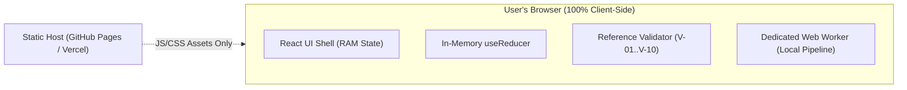

# Missiq

> **Miss less. Know more.** — *Your private chat intelligence.*

Missiq is a local-first chat intelligence micro-app built for the **ProtocolX Hackathon**. It helps users quickly understand and prioritize important information from long, unread group conversations (300+ messages) without sending private chat text to third-party cloud AI services or external servers.

---

## Problem & Solution

### The Unread Problem — "What Did I Miss?"
Active group chats accumulate hundreds of messages while users are in class, meetings, or offline. Critical deadlines, task assignments, confirmed decisions, and urgent announcements get buried under banter and logistics. Copying private chats into public cloud AI tools creates severe confidentiality risks.

### The Missiq Solution
Missiq processes chat transcripts **entirely inside your browser memory** using a deterministic, rule-based analysis engine. 
* **Evidence-First:** Every task, deadline, and decision directly links to its exact source message and line range.
* **Explainable Priority:** Ranked items carry human-readable reason tags.
* **100% Local-First Privacy:** Zero backend server, zero cloud AI calls, zero web storage persistence.

---

## Features & Roadmap Status

| Feature | Category | Status | Notes |
|---|---|---|---|
| Project Scaffold & Core Types | P0 | **Implemented** | React 18, TypeScript, Vite, Tailwind CSS, Vitest |
| Application Shell & Brand | P0 | **Implemented** | Radar SVG logo, Midnight/Mint tokens, StatusChip, PrivacyFooter |
| Reference Validator (`V-01..V-10`) | P0 | **Implemented** | Strictly grounds insights in source messages |
| Local Transcript Parsing (F1–F4) | P0 | **Implemented** | Parses bracketed, dash, ISO, and bracketed Slack/Teams formats |
| Deterministic Analysis Engine | P0 | **Implemented** | Extracts tasks, deadlines, decisions, mentions, announcements |
| Explainable Priority Engine | P0 | **Implemented** | Rules R-PRI-01..12 ranking with human-readable reason tags |
| Web Worker Architecture | P0 | **Implemented** | Typed worker client, stage progress, cancellation, runId guard |
| Complete MVP UI Integration | P0 | **Implemented** | Responsive views: Import, Analyzing stepper, Briefing Results |
| Interactive Source Inspection Drawer | P0 | **Implemented** | Highlights verbatim text & surrounding context without HTML injection |
| In-Memory Task Completion & Undo | P0 | **Implemented** | Interactive checkboxes, 8s undo toast, pure RAM state |
| One-Click Memory Clearing | P0 | **Implemented** | Instantly clears transcript & derived data; cancels worker |
| Privacy & Correctness Audit | P0 | **Audited & Verified** | Zero storage/network leak, content-free errors, null-byte checks, 83 tests |
| Automated E2E & Privacy Tests | P0 | **Implemented** | Playwright tests verify zero outbound network calls and user flows |
| Static Production Deployment & Final Validation | P0 | **Verified & Ready** | Relative base (`base: './'`), CSP headers, GitHub Actions, Vercel & Netlify configs |
| Genuine On-Device AI Model | P2 | *Optional Stretch* | Evaluated strictly against Gate G-MODEL |

---

## Supported Input Formats

Missiq parses standard chat exports and copy-pasted text automatically:

1. **Format F1 (WhatsApp / Standard Bracketed):**
   ```text
   [10/03/2026, 09:12] Priya: Morning team! Reminder: project demo is on 14/03 at 4pm in Lab 2.
   [10/03/2026, 09:30] Priya: Aarav, please send the slide deck draft by tomorrow 5pm.
   ```
2. **Format F2 (Standard Dash / WhatsApp Android):**
   ```text
   10/03/2026, 09:12 - Priya: Morning team! Reminder: project demo is on 14/03 at 4pm in Lab 2.
   ```
3. **Format F3 (ISO 8601 Timestamps):**
   ```text
   2026-03-10T09:12:00Z Priya: Morning team! Reminder: project demo is on 14/03 at 4pm.
   ```
4. **Format F4 (Slack / Teams Bracketed Time-Only):**
   ```text
   [09:12] Priya: Morning team! Reminder: project demo is on 14/03 at 4pm.
   [09:30 AM] Rohan: Agreed!
   ```
5. **Plain-Text Fallback:** Lines lacking message headers are handled gracefully with a clear banner warning.

---

## Interactive Demo Script (Synthetic Data Walkthrough)

To evaluate Missiq using the synthetic hackathon test dataset (Appendix A):

1. **Open the Application:** Launch Missiq in any modern browser.
2. **Load Sample Data:** Click the **"Load sample"** button on the input screen. This populates a synthetic conversation between Priya, Rohan, Meera, Karan, and Aarav.
3. **Verify Identity Configuration:** Note that your configured name defaults to `Aarav`.
4. **Run Analysis:** Click **"Analyze transcript"**.
   - Notice the 4-stage Web Worker progress indicator clearly labelled **"Local rule-based analysis"**.
   - Processing completes client-side in under 1 second without blocking the main UI thread.
5. **Inspect the Executive Briefing & Ranked Feed:**
   - **Critical Action Item:** See Aarav's assigned task (*"send the slide deck draft"*) marked **Critical** with the reason *"Assigned to you · due Wed 11 Mar 17:00 (within 48 h)"*.
   - **Confirmed Decision:** Observe *"Let's go with Firebase. Final decision."* categorized as a confirmed decision, while Meera's suggestion (*"maybe we should move the demo to the 15th?"*) remains marked as a low-priority suggestion.
   - **Direct Mention:** Notice Rohan's query (*"Aarav, are you free to review it?"*) highlighted under Mentions.
6. **Test In-Memory Task Interaction:**
   - Click the completion checkbox on Aarav's task. It immediately strikes through and moves to completed.
   - An 8-second **Undo Toast** appears in the bottom right corner allowing you to revert the action.
7. **Inspect Source Evidence:**
   - Click the source badge `[m-5]` or the finding card.
   - The accessible **Source Drawer** opens, displaying the verbatim source message, exact line numbers (`L7-L7`), sender, timestamp, and highlighted evidence span.
   - Toggle **"Show surrounding context"** to view ±2 neighbouring messages.
8. **Verify One-Click Memory Clearing:**
   - Click **"Clear all data"** in the top navigation or results view.
   - The entire transcript, derived insights, and task state are wiped from memory immediately. Browser storage (`localStorage`, `sessionStorage`, `IndexedDB`, cookies) remains completely empty (`0` items).

---

## Technology Stack

* **UI Framework:** React 18 + TypeScript (strict mode)
* **Build Tool:** Vite 5 static SPA builder (`base: './'` for total hosting portability)
* **Styling:** Tailwind CSS 3 (Midnight `#080D14`, Graphite `#18232F`, Signal Mint `#35E0B1`, Ice White `#F2F7F9`)
* **State Architecture:** Pure in-memory `useReducer` + Context (RAM only)
* **Execution Engine:** Dedicated typed Web Worker (`analysis.worker.ts`)
* **Testing:** Vitest (unit/component), @testing-library/react, Playwright (E2E)
* **Linting & Hygiene:** ESLint 9 with strict TypeScript rules and web storage restriction guards

---

## Getting Started

### Prerequisites
* Node.js v18+ (tested on Node v24.15.0)
* npm v9+

### Installation
```bash
git clone https://github.com/mominabrarm/missiq.git
cd missiq
npm install
```

### Development Server
```bash
npm run dev
```
Open [http://localhost:5173](http://localhost:5173) in your browser.

### Building for Production
```bash
npm run build
npm run preview
```

---

## Testing & Quality Gates

Run all quality checks locally:

```bash
# Run 83 unit and privacy audit tests
npm test

# Run TypeScript strict typecheck
npm run typecheck

# Run ESLint check (zero warnings allowed)
npm run lint

# Run Playwright E2E privacy and journey tests
npm run test:e2e
```

### Manual Privacy Verification Protocol
To verify Missiq's local-first privacy guarantee yourself:
1. Open Missiq in Google Chrome, Edge, or Firefox.
2. Open DevTools (`F12` or `Right-Click -> Inspect`) and select the **Network** tab.
3. Paste a conversation and click **Analyze**.
4. Observe the Network log: filter by `Fetch/XHR/WS/Other`.
5. **Expected Result:** Zero outbound network requests carrying chat content or calling third-party AI APIs.

---

## Deployment & Hosting Guide

Missiq compiles to a standalone static single-page application (`dist/`). Because asset paths use relative links (`base: './'`), the built application can be deployed to any static host without configuration changes.

### Current Deployment Status
* **Production Build:** Verified clean (`npm run build`), producing `dist/index.html`, `dist/favicon.svg`, and code-split chunks for the application and Web Worker.
* **Hosting Configurations:** Pre-configured and tested for GitHub Pages, Vercel, and Netlify.
* **Remote Publishing:** Because no third-party cloud hosting credentials or tokens are stored in the local workspace, deployment can be published by pushing to GitHub or linking your static hosting provider:

#### Option 1: GitHub Pages (Automated CI/CD)
A GitHub Actions workflow is included at `.github/workflows/deploy.yml`:
1. Push commits to `main`: `git push origin main`.
2. In your GitHub repository, navigate to **Settings > Pages**.
3. Under **Build and deployment > Source**, select **GitHub Actions**.
4. The workflow will automatically test, typecheck, build, and deploy Missiq to `https://<your-username>.github.io/missiq/`.

#### Option 2: Vercel
Configuration is provided in `vercel.json` with strict Content-Security-Policy headers:
```bash
npx vercel deploy --prod
```
Or import the repository directly in the Vercel web dashboard.

#### Option 3: Netlify
Configuration is provided in `netlify.toml` with strict CSP and security headers:
```bash
npx netlify deploy --prod --dir=dist
```
Or connect the repository via the Netlify dashboard.

#### Option 4: Local Static Server
To preview the verified production bundle locally:
```bash
npm run build
npm run preview
```

---

## Architecture & Privacy Model



### External Network Dependencies
| Host / Service | Purpose | Data Sent | Required? |
|---|---|---|---|
| App Static Host | Initial HTML/JS/CSS download | Standard HTTP request headers (IP, User-Agent) | Yes (on initial page load) |
| Cloud AI APIs | None | **NO DATA EVER SENT** | No |
| Analytics / Telemetry | None | **NONE** | No |

### Offline & Runtime Limitations
* **Local Offline Processing:** Once the static assets are loaded, all parsing, analysis, filtering, and data clearing run completely offline without an internet connection.
* **Offline Reload Limitation:** Refreshing or reloading the browser tab while disconnected from the internet requires an asset-caching Service Worker (planned for MVP P2 per PRD §NFR-10).

---

## AI Implementation Disclosure

* **Runtime Analysis:** Uses a **deterministic, rule-based local analysis engine** running in JS/Web Worker. It is honestly labelled as "Local rule-based analysis" and is never described as "generative AI" or "LLM".
* **Build-Time Assistance:** Development utilized Antigravity AI pair programmer for code architecture, typing, and test generation under human oversight. No cloud AI services are called by the deployed application.

---

## Hackathon Compliance Checklist

| # | Requirement | Status | Verification Evidence |
|---|---|---|---|
| H-01 | Public GitHub repository with meaningful commit history | **Ready** | Full phased commit history on branch `main` |
| H-02 | Static production deployment ready | **Ready** | Clean `dist/` bundle; CI/CD workflows for GitHub Pages, Vercel, Netlify |
| H-03 | Project description & alignment with problem statement | **Complete** | Focuses squarely on "The Unread Problem — What Did I Miss?" |
| H-04 | Accurate disclosure of GenAI services | **Disclosed** | Rule-based runtime engine; Antigravity assistant at build time only |
| H-05 | Functional demonstration of required workflow | **Complete** | Sample loading, analysis, ranked feed, source drawer, memory clear |
| H-06 | Verification of local-first privacy | **Verified** | Automated E2E network monitoring, zero web storage items, sentinel leak test |
| H-07 | Working build and passing tests | **Verified** | 83/83 unit tests, 4/4 Playwright tests, zero TypeScript/ESLint warnings |
| H-08 | README.md and prompt.md truthful and up to date | **Complete** | Detailed records of prompts, architecture, and verification results |
| H-09 | Accessibility basics verified | **Verified** | ARIA dialogs, focus trapping, keyboard navigation, safe text nodes |
| H-10 | No fabricated claims | **Compliant** | Honest labelling, no invented benchmarks or synthetic certs |

---

## License & Dependencies

Licensed under the [MIT License](LICENSE).
Runtime dependencies: `react` (^18.3.1), `react-dom` (^18.3.1).
