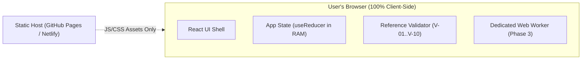

# Missiq

> **Miss less. Know more.** — *Your private chat intelligence.*

Missiq is a local-first chat intelligence micro-app built for the **ProtocolX Hackathon**. It helps users quickly understand and prioritize important information from long, unread group conversations (300+ messages) without sending private chat text to third-party cloud AI services or external servers.

---

## Problem & Solution

### The Unread Problem — "What Did I Miss?"
Active group chats accumulate hundreds of messages while users are in class, meetings, or offline. Critical deadlines, task assignments, confirmed decisions, and urgent announcements get buried under banter and logistics. Copying private chats into public cloud AI tools creates data privacy and confidentiality risks.

### The Missiq Solution
Missiq processes chat transcripts **entirely inside your browser memory** using a deterministic, rule-based analysis engine. 
* **Evidence-First:** Every task, deadline, and decision directly links to its exact source message and line range.
* **Explainable Priority:** Ranked items carry human-readable reason tags.
* **100% Local-First Privacy:** Zero backend server, zero cloud AI calls, zero web storage persistence.

---

## Features & Roadmap Status

| Feature | Category | Status | Notes |
|---|---|---|---|
| Project Scaffold & Core Types | P0 | **Implemented** | React 18, TypeScript, Vite, Tailwind CSS, Vitest |
| Application Shell & Brand | P0 | **Implemented** | Radar SVG logo, Midnight/Mint tokens, StatusChip, PrivacyFooter |
| Reference Validator (`V-01..V-10`) | P0 | **Implemented** | Strictly grounds insights in source messages |
| Unit Tests (`tests/unit/model.test.ts`) | P0 | **Implemented** | 100% pass on data model & validator rules |
| Local Transcript Parsing (F1–F4) | P0 | *Pending Phase 3* | Parses bracketed, dash, ISO, and sender-only formats |
| Local Analysis Engine (Tasks/Dates) | P0 | *Pending Phase 3* | Extracts deadlines, tasks, and negation markers |
| Priority Feed & Briefing Dashboard | P0 | *Pending Phase 4* | Rule table R-PRI-01..12 and template briefing |
| Interactive Source Drawer | P0 | *Pending Phase 5* | Highlights verbatim text & context without HTML injection |
| Playwright Privacy Verification | P0 | **Configured** | E2E test verifying zero outbound network calls |
| Genuine On-Device AI Model | P2 | *Optional Stretch* | Evaluated strictly against Gate G-MODEL |

---

## Technology Stack

* **UI Framework:** React 18 + TypeScript (strict mode)
* **Build Tool:** Vite 5 static SPA builder
* **Styling:** Tailwind CSS 3 (Midnight `#080D14`, Graphite `#18232F`, Signal Mint `#35E0B1`, Ice White `#F2F7F9`)
* **State Architecture:** Pure in-memory `useReducer` + Context (RAM only)
* **Testing:** Vitest (unit/component), @testing-library/react, Playwright (E2E)
* **Linting & Hygiene:** ESLint 9 with TypeScript rules and storage API restriction guards

---

## Getting Started

### Prerequisites
* Node.js v18+ (tested on Node v24.15.0)
* npm v9+

### Installation
```bash
git clone https://github.com/your-repo/missiq.git
cd missiq
npm install
```

### Development Server
```bash
npm run dev
```
Open [http://localhost:5173](http://localhost:5173) in your browser.

### Building for Production
```bash
npm run build
npm run preview
```

---

## Testing & Quality Gates

Run all quality checks locally:

```bash
# Run unit tests
npm test

# Run TypeScript type checking
npm run typecheck

# Run ESLint check
npm run lint

# Run Playwright E2E privacy tests
npm run test:e2e
```

### Manual Privacy Verification Protocol
To verify Missiq's local-first privacy guarantee yourself:
1. Open Missiq in Google Chrome or Microsoft Edge.
2. Open DevTools (`F12` or `Right-Click -> Inspect`) and select the **Network** tab.
3. Paste a conversation and click **Analyze**.
4. Observe the Network log: filter by `Fetch/XHR/WS/Other`.
5. **Expected Result:** Zero outbound network requests carrying chat content or calling third-party AI APIs.

---

## Architecture & Privacy Model



### External Network Dependencies
| Host / Service | Purpose | Data Sent | Required? |
|---|---|---|---|
| App Static Host | Initial HTML/JS/CSS download | Standard HTTP request headers (IP, User-Agent) | Yes (on page load) |
| Cloud AI APIs | None | **NO DATA EVER SENT** | No |
| Analytics / Telemetry | None | **NONE** | No |

---

## AI Implementation Disclosure

* **Runtime Analysis:** Uses a **deterministic, rule-based local analysis engine** running in JS/Web Worker. It is honestly labelled as "Local rule-based analysis" and is never referred to as "generative AI" or "LLM".
* **Build-Time Assistance:** Development utilized Antigravity AI pair programmer for code architecture, typing, and test generation under human oversight. No cloud AI services are called by the deployed application.

---

## License & Dependencies

Licensed under the [MIT License](LICENSE).
Runtime dependencies: `react` (^18.3.1), `react-dom` (^18.3.1).
